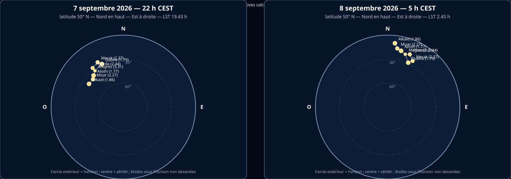
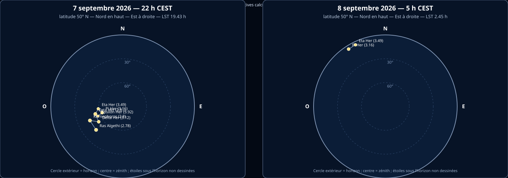
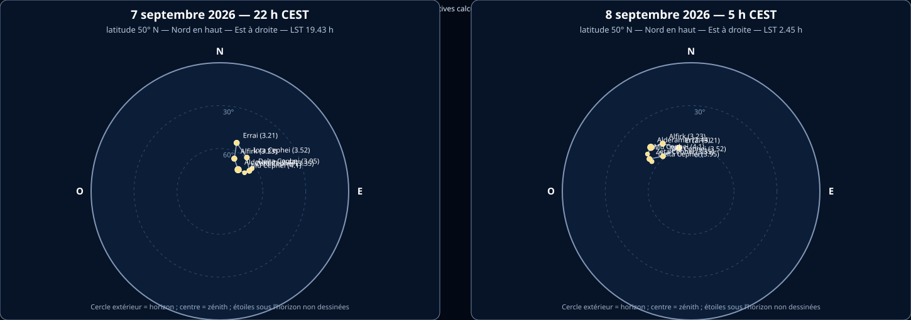

# Constellations d’étude — Grande Ourse, Hercule et Céphée

## Objectif de la formation

Pour chaque constellation, cette fiche doit permettre de :

- reproduire le dessin principal ;
- nommer les étoiles principales ;
- localiser la constellation depuis la Belgique ;
- distinguer ce qui est visible à l’œil nu, aux jumelles ou au télescope ;
- identifier les objets Messier et NGC associés ;
- préparer une observation guidée.

## Rappel — magnitude apparente

La **magnitude apparente** indique l’éclat d’un astre vu depuis la Terre. L’échelle est inversée : plus la valeur est petite, plus l’astre paraît brillant. Une étoile de magnitude 2 est donc plus brillante qu’une étoile de magnitude 4.

Les valeurs ci-dessous sont des valeurs visuelles indicatives, généralement arrondies au centième. Pour les étoiles variables, une plage est préférable à une valeur unique. La visibilité dépend du ciel, de la hauteur au-dessus de l’horizon, de la transparence et de l’adaptation de l’œil.

> **Méthode :** les dessins sont des schémas d’apprentissage et non des cartes stellaires à l’échelle. Pour une observation réelle, vérifier la date, l’heure, le lieu, la hauteur et la magnitude dans Stellarium ou une carte du ciel.

## Sources de vérification

- [Stellarium Web](https://stellarium-web.org/) — position réelle selon date, heure et lieu.
- [In-The-Sky — catalogue et constellations](https://in-the-sky.org/data/)
- [NASA Skywatching](https://science.nasa.gov/skywatching/)
- [NASA — objets du Système solaire et ciel profond](https://science.nasa.gov/)
- [NOIRLab — figures des constellations](https://noirlab.edu/public/education/constellations/)
- [IAU stick figures — données et convention de tracé](https://github.com/dcf21/constellation-stick-figures)

## Cartes orientées pour la Belgique — 7 septembre 2026

Les cartes ci-dessous donnent deux états de la même nuit : **22 h 00 le 7 septembre** et **05 h 00 le 8 septembre 2026**. L’heure est l’heure légale belge d’été (**CEST, UTC+2**). Le calcul est réalisé pour une latitude de **50° N** et une longitude indicative de **4,5° E** ; il convient donc comme support de formation pour la Belgique, mais une carte locale précise peut varier légèrement selon le lieu.

Convention de lecture : **Nord en haut, Est à droite, Sud en bas, Ouest à gauche**. Le bord du cercle représente l’horizon et le centre représente le zénith. Les étoiles sous l’horizon ne sont pas dessinées. Les lignes indiquent uniquement la figure pédagogique de la constellation ; elles ne représentent pas des limites officielles.

**Correction des dessins :** les figures ont été reprises avec une convention de type « stick figure » utilisée dans les cartes de planétarium. Il n’existe pas une seule manière officiellement obligatoire de relier les étoiles d’une constellation. La Grande Ourse montre le Grand Chariot et quelques étoiles de la silhouette de l’Ourse ; Hercule montre explicitement le Keystone (π–η–ζ–ε Her) et les prolongements de la figure ; Céphée montre la maison classique à cinq sommets. Les étoiles ajoutées pour compléter la silhouette sont identifiées dans les cartes par leur nom et leur magnitude.

Ces cartes indiquent la position du ciel à deux heures précises. Elles ne remplacent pas une carte détaillée de cheminement pour les objets faibles. Pour les objets Messier et NGC, utiliser ensuite les jalons indiqués dans les fiches ci-dessous avec des jumelles ou un télescope.

---

## 1. Grande Ourse — Ursa Major (UMa)

### Repérage dans le ciel

La Grande Ourse est une grande constellation du ciel boréal. Son astérisme principal est le **Grand Chariot** ou **Big Dipper**, formé par sept étoiles brillantes. Depuis la Belgique, il est circumpolaire ou très facilement observable une grande partie de l’année.

Repère principal : les deux étoiles du bord de la « casserole », **Merak** et **Dubhe**, prolongées environ cinq fois, indiquent la direction de **Polaris**, dans la Petite Ourse.

### Dessin à reproduire

### Étoiles principales

| Étoile | Désignation | Magnitude visuelle indicative | Rôle dans le dessin | Visibilité |
|---|---|---:|---|---|
| Dubhe | α UMa | 1,79 | étoile supérieure du bord de la casserole ; repère vers Polaris | œil nu |
| Merak | β UMa | 2,37 | étoile inférieure du bord ; repère vers Polaris | œil nu |
| Phecda | γ UMa | 2,44 | base de la casserole | œil nu |
| Megrez | δ UMa | 3,31 | jonction entre casserole et manche | œil nu |
| Alioth | ε UMa | 1,77 | partie centrale du manche | œil nu |
| Mizar | ζ UMa | 2,27 | coude du manche | œil nu |
| Alkaid | η UMa | 1,86 | extrémité du manche | œil nu |

**Point pédagogique :** Mizar et Alcor forment un couple visuel intéressant. Alcor peut être séparée de Mizar à l’œil nu par de nombreux observateurs ; les jumelles montrent plus facilement la région et la nature multiple de Mizar.

### Objets Messier et NGC

| Objet | Désignation NGC | Nature | Moyen conseillé | Localisation pratique |
|---|---:|---|---|---|
| M40 | — | étoile double/optique | jumelles ou petit télescope | entre Megrez et Phecda, dans la région de la Grande Ourse |
| M81 | NGC 3031 | galaxie spirale | jumelles sous ciel sombre ; télescope préférable | avec M82, dans la région nord de la constellation ; utiliser les étoiles de la Grande Ourse comme jalons |
| M82 | NGC 3034 | galaxie irrégulière/starburst | jumelles sous ciel sombre ; télescope préférable | proche de M81 ; les deux objets sont un couple d’observation |
| M97 | NGC 3587 | nébuleuse planétaire | télescope | près de l’étoile Merak, dans la zone du Grand Chariot |
| M101 | NGC 5457 | galaxie spirale | jumelles sous très bon ciel, difficile ; télescope | près de la région Mizar–Alkaid |
| M108 | NGC 3556 | galaxie | télescope | proche de Merak et de M97 |
| M109 | NGC 3992 | galaxie spirale barrée | télescope | proche de Phecda |

**À retenir pour la formation :** la Grande Ourse est une constellation riche en galaxies, mais leur observation dépend fortement de la pollution lumineuse. « Visible aux jumelles » signifie ici détectable comme faible tache sous un ciel favorable, pas observable avec le même détail qu’une photographie.

### Fiche de localisation

1. Repérer les sept étoiles du Grand Chariot.
2. Identifier Merak et Dubhe.
3. Prolonger leur ligne vers Polaris.
4. Utiliser Mizar comme repère pour la zone de M101.
5. Utiliser Merak comme repère pour la zone M97–M108.
6. Utiliser Phecda comme repère pour M109.

---

## 2. Hercule — Hercules (Her)

### Repérage dans le ciel

Hercule est une grande constellation boréale, particulièrement intéressante au printemps et en été depuis la Belgique. Elle se situe entre la Lyre, la Couronne boréale et le Serpentaire.

Son repère principal est le **Trapèze ou Keystone d’Hercule**, quadrilatère formé par quatre étoiles. Il faut le distinguer de la forme mythologique complète, beaucoup moins immédiatement lisible.

### Dessin à reproduire

### Étoiles principales

| Étoile | Désignation | Magnitude visuelle indicative | Rôle dans le dessin | Visibilité |
|---|---|---:|---|---|
| Kornephoros | β Her | 2,80 | l’une des étoiles brillantes de la constellation | œil nu |
| Ras Algethi | α Her | 2,78, variable | étoile remarquable, souvent décrite comme une étoile multiple et colorée | œil nu ; séparation instrumentale |
| Pi Her | π Her | 3,16 | repère du Keystone | œil nu sous ciel correct |
| Eta Her | η Her | 3,49 | côté ouest du Keystone ; repère vers M13 | œil nu sous ciel correct |
| Zeta Her | ζ Her | 2,81 | côté ouest du Keystone ; repère vers M13 | œil nu sous ciel correct |
| Epsilon Her | ε Her | 3,92 | côté est du Keystone | œil nu sous ciel correct |
| Delta Her | δ Her | 3,12 | zone sud de la constellation | œil nu |

### Objets Messier et NGC

| Objet | Désignation NGC | Nature | Moyen conseillé | Localisation pratique |
|---|---:|---|---|---|
| M13 | NGC 6205 | amas globulaire | jumelles ; télescope pour résoudre des étoiles | environ entre Eta Her et Zeta Her, sur le côté ouest du Keystone |
| M92 | NGC 6341 | amas globulaire | jumelles ; télescope | partie nord de la constellation ; utiliser Pi et Eta Her comme repères |
| NGC 6210 | — | nébuleuse planétaire | jumelles comme défi ; télescope recommandé | à rechercher dans la partie sud-ouest, près de Zeta Her |
| NGC 6207 | — | galaxie | télescope | très proche de M13 ; objet complémentaire lorsque M13 est pointé |
| NGC 6229 | — | amas globulaire | télescope | partie nord d’Hercule ; objet plus exigeant que M13 et M92 |

M13 peut être soupçonné aux jumelles comme une petite tache diffuse. Dans un télescope, il devient un amas globulaire spectaculaire. Une visibilité à l’œil nu est possible sous un ciel très noir pour certains observateurs, mais ne doit pas être présentée comme garantie.

### Fiche de localisation

1. Repérer Véga dans la Lyre.
2. Chercher le grand quadrilatère du Keystone à l’est ou au sud-est de Véga.
3. Identifier Eta et Zeta Her sur le côté ouest du Keystone.
4. Balayer environ le tiers de la distance entre ces deux étoiles pour trouver M13.
5. Utiliser Pi et Eta Her pour remonter vers M92.
6. Pour une observation publique, commencer par M13, puis proposer M92 et NGC 6207 en approfondissement.

---

## 3. Céphée — Cepheus (Cep)

### Repérage dans le ciel

Céphée est une constellation boréale située près de Cassiopée et de l’étoile polaire. Son astérisme principal ressemble à une **maison** ou à un pentagone avec un toit pointu. Depuis la Belgique, elle est très favorable à l’observation et une grande partie de la constellation est circumpolaire.

Repères : partir de Cassiopée ou de Polaris, puis chercher la forme de maison. **Alderamin** est l’étoile la plus brillante de la constellation.

### Dessin à reproduire

### Étoiles principales

| Étoile | Désignation | Magnitude visuelle indicative | Particularité | Visibilité |
|---|---|---:|---|---|
| Alderamin | α Cep | 2,44 | étoile la plus brillante de Céphée | œil nu |
| Alfirk | β Cep | 3,23, variable | étoile variable de type Beta Cephei | œil nu |
| Errai | γ Cep | 3,21 | repère proche de la région polaire ; système multiple | œil nu |
| Delta Cephei | δ Cep | 3,5–4,4, variable | prototype des étoiles variables céphéides | œil nu ; variation à suivre |
| Zeta Cephei | ζ Cep | 3,35 | étoile brillante du dessin | œil nu |
| Iota Cephei | ι Cep | 3,52 | repère de la partie nord-est | œil nu sous bon ciel |
| Mu Cephei | μ Cep | autour de 4,1, variable | supergéante rouge, « étoile Grenat » de Herschel | œil nu ; couleur aux jumelles |

### Objets Messier et NGC

Céphée ne contient pas d’objet Messier officiellement associé. Elle est cependant riche en objets NGC et IC, souvent plus adaptés aux jumelles et au télescope.

| Objet | Nature | Moyen conseillé | Localisation pratique |
|---|---|---|---|
| NGC 188 | amas ouvert | jumelles ou petit télescope | très près du pôle céleste nord ; zone de Polaris et de la Petite Ourse |
| NGC 6939 | amas ouvert | jumelles sous ciel sombre ; télescope | partie sud de Céphée |
| NGC 7160 | amas ouvert | jumelles | près d’Eta Cephei ; repère par balayage depuis Alderamin |
| NGC 7380 | amas ouvert + nébuleuse | jumelles ; télescope pour la nébuleuse | région sud-ouest de Céphée ; souvent appelé Wizard Nebula pour la nébuleuse |
| NGC 7510 | amas ouvert | jumelles ou petit télescope | partie sud-est de la constellation |
| NGC 7023 | nébuleuse par réflexion | télescope ou astrophotographie ; jumelles difficiles | région de l’étoile variable entourée de nébulosité |
| NGC 40 | nébuleuse planétaire | télescope | objet faible, à ne pas promettre aux jumelles ordinaires |
| NGC 6946 | galaxie spirale | télescope sous ciel sombre | proche de la frontière Céphée–Cygne ; souvent appelée Fireworks Galaxy |

### Fiche de localisation

1. Repérer Polaris.
2. Chercher Cassiopée, puis se déplacer vers la forme de maison de Céphée.
3. Identifier Alderamin comme étoile principale.
4. Repérer Delta Cephei pour introduire les étoiles variables céphéides.
5. Repérer Mu Cephei pour montrer une étoile rouge à l’œil nu ou aux jumelles.
6. Pour une première observation instrumentale, choisir NGC 7160, NGC 7380 ou NGC 6939 selon la saison et le ciel.

---

## Comparaison rapide pour l’examen

| Constellation | Figure principale | Repère majeur | Messier | Objets remarquables |
|---|---|---|---:|---|
| Grande Ourse | Grand Chariot | Merak–Dubhe vers Polaris | 7 | M81/M82, M97, M101, M108, M109 |
| Hercule | Keystone/Trapèze | entre Lyre et Couronne boréale | 2 | M13, M92, NGC 6207 |
| Céphée | Maison/pentagone | près de Polaris et Cassiopée | 0 | NGC 188, NGC 6939, NGC 7380, NGC 6946 |

## Sources des magnitudes

- [TheSkyLive — étoiles brillantes de la Grande Ourse](https://theskylive.com/sky/constellations/ursa_major-bright-stars)
- [In-The-Sky — constellation d’Hercule](https://in-the-sky.org/data/constellation.php?id=41)
- [TheSkyLive — étoiles brillantes de Céphée](https://theskylive.com/sky/constellations/cepheus-bright-stars)

Les catalogues peuvent différer de quelques centièmes selon la bande photométrique, l’époque et le traitement des étoiles multiples ou variables. Pour un exercice noté, reprendre les valeurs demandées par le formateur ou celles affichées dans la carte utilisée pendant la séance.

## Sources web utilisées pour la préparation

- [In-The-Sky — Ursa Major](https://in-the-sky.org/data/constellation.php?id=85)
- [In-The-Sky — Hercules](https://in-the-sky.org/data/constellation.php?id=41)
- [In-The-Sky — Cepheus](https://in-the-sky.org/data/constellation.php?id=21)
- [TheSkyLive — objets du ciel profond de Céphée](https://theskylive.com/sky/constellations/cepheus-deepsky-objects)
- [NASA Skywatching](https://science.nasa.gov/skywatching/)

> Les seuils « œil nu » et « jumelles » sont indicatifs. La pollution lumineuse, la transparence, la hauteur de l’objet, l’adaptation de l’œil et la qualité des jumelles changent fortement le résultat.

## Méthode de calcul et limites

Les positions sont calculées à partir des coordonnées équatoriales indicatives des étoiles principales, de la date, de l’heure légale convertie en UTC, de la longitude de référence et de la latitude du lieu. La projection utilisée est une vue du ciel local : l’altitude est représentée radialement, tandis que l’azimut est orienté depuis le Nord dans le sens horaire. Les magnitudes servent à dimensionner les symboles des étoiles, mais ne constituent pas une mesure de visibilité du ciel réel.

**Source et traçabilité :** script de génération `scripts/generate_constellation_maps.py`, coordonnées et magnitudes documentées dans cette fiche, contrôle astronomique complémentaire recommandé dans Stellarium pour le lieu exact d’observation.
