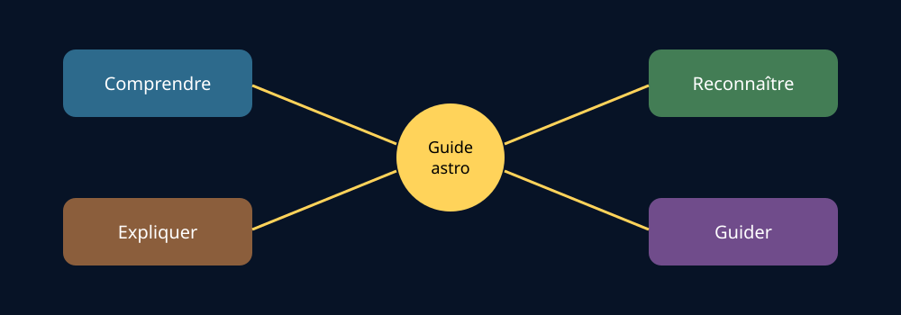

# Module 1 — Objectifs du module d’astronomie

## Positionnement

Cette fiche synthétise les objectifs explicitement indiqués dans le document source. Elle sert de carte de progression pour la formation de guide astro ; elle ne remplace pas les consignes officielles de l’organisme de formation.

## Source

- **Document :** `Astronomie.pdf — Introduction à l’astronomie`
- **Édition :** 2024
- **Pages :** 1–2 du document PDF
- **Source Drive :** [Astronomie.pdf](https://drive.google.com/file/d/1VKdzcqjsHL7iiYPSFOkPYnqRRlyCM-Fq/view?usp=drivesdk)
- **Nature :** objectifs évalués en fin de module et objectifs potentiellement évalués dans le portfolio ou lors de l’excursion guidée.

## Support visuel — les quatre compétences du guide

*Figure 1 — Comprendre, reconnaître, expliquer et guider. Schéma original créé pour ce support ; il s’agit d’une grille pédagogique de travail, pas d’une nouvelle exigence officielle.*

## Ressources complémentaires

- [Skywatching Tips — NASA](https://science.nasa.gov/skywatching/)
- [How to Find Good Places to Stargaze — NASA](https://science.nasa.gov/solar-system/how-to-find-good-places-to-stargaze/)

Ces ressources illustrent la dimension pratique de l’observation. Les exigences officielles restent celles du syllabus et de l’organisme de formation.

## Objectifs évalués en fin de module

À l’issue du module, le document demande notamment de pouvoir :

1. **Expliquer le système Terre–Soleil**
   - distinguer rotation et révolution ;
   - distinguer journée diurne et journée sidérale ;
   - expliquer les saisons, les solstices et les équinoxes ;
   - représenter ces notions sur un schéma.

2. **Présenter la Lune et ses influences**
   - citer ses caractéristiques principales et ses différences avec la Terre ;
   - expliquer les phases lunaires ;
   - expliquer le principe des éclipses ;
   - expliquer les marées et distinguer vives-eaux et mortes-eaux.

3. **Décrire le Soleil**
   - connaître ses principaux ordres de grandeur ;
   - situer les taches et les éruptions solaires sur une image.

4. **Présenter le Système solaire**
   - définir une planète ;
   - citer une caractéristique de chacune des huit planètes ;
   - reconnaître Jupiter, Saturne et Mars ;
   - expliquer le statut de Pluton ;
   - distinguer astéroïde et comète.

5. **Employer les unités de distance adaptées**
   - unité astronomique ;
   - année-lumière ;
   - parsec.

6. **Maîtriser les bases du ciel étoilé**
   - définir une étoile ;
   - expliquer sommairement sa composition, sa température et sa lumière ;
   - comprendre la magnitude ;
   - définir une constellation ;
   - retrouver la Grande Ourse, la Petite Ourse, Cassiopée et Orion.

7. **Utiliser les coordonnées astronomiques de base**
   - comprendre le principe de la déclinaison et de l’ascension droite.

8. **Distinguer astronomie et astrologie sur le cas du zodiaque**
   - décrire les constellations du zodiaque astronomique ;
   - les comparer au zodiaque astrologique.

9. **Présenter notre Galaxie et l’Univers**
   - nommer la Voie lactée ;
   - la caractériser succinctement ;
   - donner un ordre de grandeur du nombre d’étoiles dans l’Univers.

10. **Préparer une observation guidée**
    - connaître les conditions favorables ;
    - choisir et utiliser les équipements adaptés ;
    - utiliser une carte du ciel ;
    - repérer et faire repérer des objets célestes.

## Objectifs liés au guidage et au portfolio

Le document prévoit également des compétences pratiques et de communication :

- préparer une soirée astronomique ;
- sélectionner les objets observables depuis un lieu donné ;
- les localiser avec une méthode adaptée au public ;
- utiliser la main, des jumelles, une longue-vue ou un télescope ;
- construire un argumentaire accessible sur la pollution lumineuse, les impacts d’objets célestes, la vie extraterrestre et l’habitabilité d’autres mondes.

## Lecture pédagogique de Gérard

Ces objectifs se regroupent en quatre compétences :

- **Comprendre :** phénomènes Terre–Soleil–Lune, objets et distances ;
- **Reconnaître :** objets, constellations et phénomènes sur le ciel ou une image ;
- **Expliquer :** formuler une réponse claire pour un public non spécialiste ;
- **Guider :** préparer, sélectionner, localiser et montrer des objets célestes.

Cette organisation est une synthèse de travail de Gérard ; elle ne constitue pas une nouvelle exigence officielle.

## Fiche de vérification

- [ ] Je peux expliquer la différence entre rotation et révolution.
- [ ] Je peux expliquer pourquoi les saisons ne sont pas principalement dues à la distance Terre–Soleil.
- [ ] Je peux représenter les phases de la Lune.
- [ ] Je peux distinguer planète, planète naine, astéroïde et comète.
- [ ] Je sais quand employer ua, année-lumière et parsec.
- [ ] Je peux définir magnitude apparente et constellation.
- [ ] Je peux retrouver les quatre constellations demandées.
- [ ] Je peux préparer une observation simple pour un public débutant.

## Points à confirmer

- Les modalités précises d’évaluation et le calendrier ne sont pas détaillés dans cette fiche.
- Les sigles et renvois internes du tableau source, notamment `TPGN`, doivent être confirmés dans les documents officiels de la formation.
