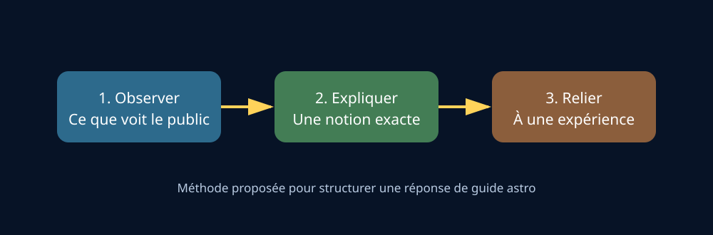
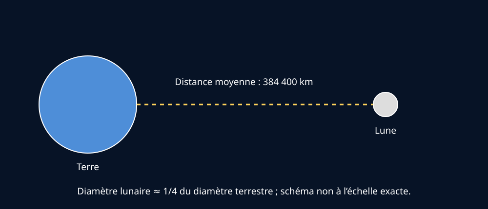

# Module 2 — Introduction à l’astronomie

## Source

- **Document :** `Astronomie.pdf — Introduction à l’astronomie`
- **Édition :** 2024
- **Pages :** 3 du document PDF
- **Source Drive :** [Astronomie.pdf](https://drive.google.com/file/d/1VKdzcqjsHL7iiYPSFOkPYnqRRlyCM-Fq/view?usp=drivesdk)

## Supports visuels

*Figure 1 — Observer, expliquer, relier à une expérience. Schéma original créé pour ce support.*

*Figure 2 — La distance moyenne Terre–Lune est d’environ 384 400 km. La représentation est pédagogique et non à l’échelle exacte.*

## Ressources complémentaires

- [Modeling the Earth-Moon System — NASA JPL Education](https://www.jpl.nasa.gov/edu/resources/lesson-plan/modeling-the-earth-moon-system/)
- [Seeing the Earth, Moon, and Sun to Scale — NASA](https://www.grc.nasa.gov/www/k-12/Numbers/Math/Mathematical_Thinking/seeing_the_earth_moon.htm)

Ces ressources sont utiles pour transformer les ordres de grandeur en démonstration de terrain.

## Rôle du module

Le syllabus se présente comme une introduction généraliste destinée à des candidats guides-nature et astronomes amateurs. L’objectif pratique est de permettre d’expliquer le ciel lors d’une sortie, d’une balade nocturne ou d’une animation, y compris lorsque le public pose des questions en marge de l’activité principale.

## Idées essentielles

- Le ciel est un support d’observation et de dialogue avec le public.
- Le guide doit pouvoir répondre à des questions élémentaires sans transformer chaque animation en cours complet d’astronomie.
- Le niveau attendu est généraliste : il faut privilégier les notions solides, les ordres de grandeur et une formulation accessible.
- L’observation astronomique s’inscrit dans un contexte réel : heure, saison, phase de la Lune, météo, pollution lumineuse, horizon et matériel disponible.

## Compétence de guide

Le guide astro doit être capable de faire le lien entre :

1. ce que le public voit réellement ;
2. une explication scientifique courte ;
3. une éventuelle observation ou démonstration.

Exemple de méthode :

- partir d’un objet visible ;
- demander ce que le public remarque ;
- expliquer une seule notion à la fois ;
- vérifier que l’explication est comprise ;
- proposer ensuite un approfondissement si le groupe le souhaite.

## À retenir pour une animation

Une bonne réponse de guide n’est pas nécessairement la plus longue. Elle doit être exacte, compréhensible et adaptée au niveau du groupe. Lorsqu’un point dépasse le niveau de la formation, il est préférable d’indiquer clairement la limite plutôt que d’improviser.

## Préparation personnelle

- [ ] Savoir présenter en une minute l’objectif d’une observation astronomique.
- [ ] Préparer une explication simple de la différence entre une étoile et une planète.
- [ ] Être capable de relier une question du public à un objet observable.
- [ ] Identifier les conditions qui peuvent empêcher ou modifier l’observation.

## Questions d’entraînement

1. Quel est le rôle d’un guide astro pendant une sortie nocturne ?
2. Comment adapter une explication à un public débutant ?
3. Que faire lorsqu’une question dépasse les connaissances disponibles ?
4. Comment passer d’une observation visuelle à une explication scientifique ?

## Limite de la source

Cette introduction expose l’intention générale du syllabus, mais ne fournit pas de méthode pédagogique détaillée ni de grille complète d’animation. Les propositions de conduite de groupe ci-dessus sont des recommandations de travail de Gérard, à distinguer du contenu source.
