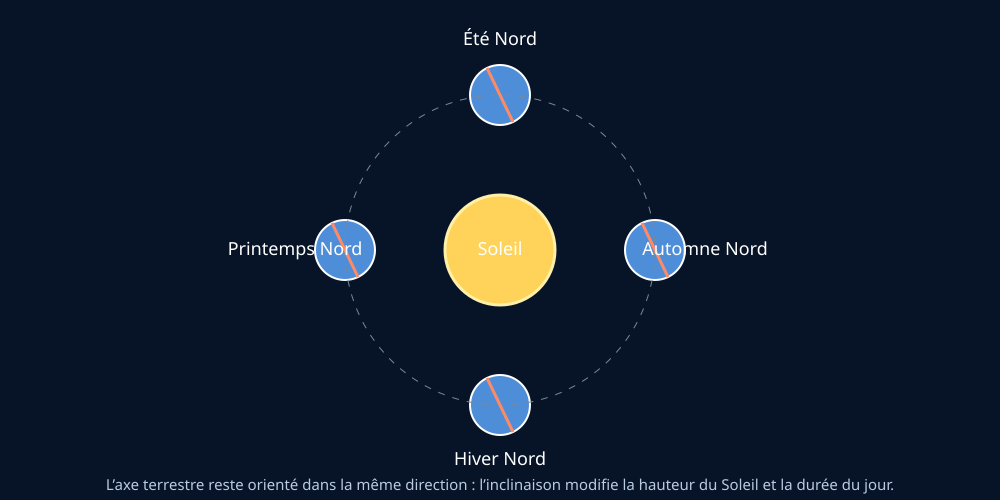
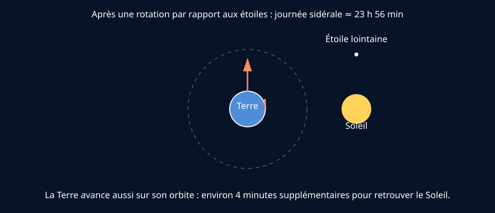
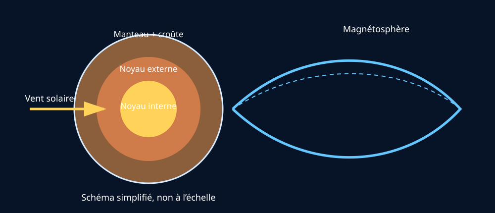

# Module 3 — La Terre : qu’est-ce que c’est ?

## Source

- **Document :** `Astronomie.pdf — Introduction à l’astronomie`
- **Édition :** 2024
- **Pages :** 4–7 du document PDF
- **Source Drive :** [Astronomie.pdf](https://drive.google.com/file/d/1VKdzcqjsHL7iiYPSFOkPYnqRRlyCM-Fq/view?usp=drivesdk)

## Supports visuels

*Figure 1 — L’inclinaison de l’axe terrestre explique l’alternance des saisons. Schéma original créé pour ce support ; non à l’échelle.*

*Figure 2 — La Terre doit tourner un peu plus pour retrouver le Soleil, car elle avance sur son orbite. Schéma original ; non à l’échelle.*

*Figure 3 — Structure interne simplifiée et interaction avec le vent solaire. Schéma original ; non à l’échelle.*

## Ressources complémentaires

- [What Causes the Seasons? — NASA Space Place](https://spaceplace.nasa.gov/seasons/)
- [Earth’s Magnetosphere — NASA Science](https://science.nasa.gov/science-research/earth-science/earths-magnetosphere-protecting-our-planet-from-harmful-space-energy/)
- [Auroras — NASA Science](https://science.nasa.gov/sun/auroras/)
- [Climate, seasons and weather — ESA Eduspace](https://esa.int/SPECIALS/Eduspace_Weather_EN/SEM62I3UFLG_0.html)

Ces ressources complètent les pages 4–7 du syllabus ; elles ne remplacent pas la source de formation.

## Objectifs

À la fin de ce module, je dois pouvoir :

- décrire les deux mouvements principaux de la Terre ;
- distinguer journée diurne et journée sidérale ;
- expliquer les saisons par l’inclinaison de l’axe terrestre ;
- définir solstice et équinoxe ;
- relier ces notions à l’observation du ciel et à la durée du jour.

## 1. Une planète avec plusieurs enveloppes

Le document présente la Terre comme une planète constituée notamment d’une croûte, d’un manteau et d’un noyau. Il distingue un noyau externe liquide et un noyau interne solide. La Terre comprend également une atmosphère et une hydrosphère.

Le noyau externe liquide est associé à la production du champ magnétique terrestre global. La magnétosphère dévie une partie des particules du vent solaire et contribue à la protection de la vie ; elle est également liée à l’existence des aurores polaires.

**Formulation pour le public :** la Terre n’est pas seulement une surface solide : sa structure interne et son champ magnétique participent aux conditions qui rendent notre environnement habitable.

## 2. Rotation et révolution

La Terre effectue deux mouvements principaux :

- **rotation :** elle tourne sur elle-même, en environ 24 heures ;
- **révolution :** elle orbite autour du Soleil, en environ 365 jours et 6 heures.

La rotation explique l’alternance générale du jour et de la nuit. La révolution intervient dans le cycle annuel et, avec l’inclinaison de l’axe terrestre, dans les saisons.

## 3. Journée diurne et journée sidérale

Une journée sidérale correspond à la durée nécessaire pour que la Terre retrouve la même orientation par rapport aux étoiles : environ 23 h 56 min 4 s.

Une journée diurne moyenne est liée au retour du Soleil à la même position apparente dans le ciel et dure environ 24 heures. La différence vient du fait que, pendant sa rotation, la Terre avance aussi sur son orbite autour du Soleil.

**Point important pour le guide :** le ciel semble se déplacer au cours de la nuit parce que la Terre tourne. Les photographies circumpolaires rendent ce mouvement particulièrement visible.

## 4. Les saisons

La Terre est légèrement plus proche du Soleil au début du mois de janvier qu’au début du mois de juillet. Dans l’hémisphère Nord, cela montre que les saisons ne sont pas principalement causées par la distance Terre–Soleil.

Le facteur principal est l’inclinaison de l’axe de rotation terrestre, donnée dans le document comme environ 23,27° par rapport à la verticale du mouvement orbital. Cette inclinaison modifie :

- la hauteur du Soleil au-dessus de l’horizon ;
- la surface éclairée par une même quantité de lumière ;
- la durée quotidienne d’éclairement.

En été, le Soleil est plus haut et la journée est plus longue : l’énergie reçue par unité de surface est plus importante et l’éclairement dure davantage. En hiver, le Soleil reste plus bas et les journées sont plus courtes.

## 5. Solstices et équinoxes

- **Solstice d’été :** autour du 21 juin dans l’hémisphère Nord ; journée la plus longue de l’année.
- **Solstice d’hiver :** autour du 21 décembre dans l’hémisphère Nord ; journée la plus courte.
- **Équinoxe :** période où la durée du jour et de la nuit est approximativement égale ; le document situe les équinoxes autour du 21 mars et du 21 septembre.

Ces dates sont des repères pratiques. Pour une explication précise, il faut tenir compte du lieu et de la définition employée pour le lever et le coucher du Soleil.

## Démonstration simple

Avec une lampe et une balle inclinée :

1. représenter le Soleil par la lampe ;
2. représenter la Terre par la balle ;
3. maintenir l’axe incliné dans la même direction pendant une révolution autour de la lampe ;
4. observer la hauteur apparente de la lumière et la taille de la zone éclairée ;
5. relier la démonstration aux saisons observées en Belgique.

Cette démonstration est une proposition pédagogique de Gérard, pas une procédure explicitement fournie par le syllabus.

## Vocabulaire

- **Rotation :** mouvement d’un astre autour de son axe.
- **Révolution :** mouvement orbital autour d’un autre astre.
- **Journée sidérale :** période de rotation mesurée par rapport aux étoiles.
- **Solstice :** moment associé à la hauteur maximale ou minimale du Soleil à midi et à la durée extrême du jour dans un hémisphère.
- **Équinoxe :** repère annuel associé à une durée du jour et de la nuit approximativement égales.
- **Magnétosphère :** région dominée par le champ magnétique terrestre, qui interagit avec le vent solaire.

## Questions fréquentes du public

**Pourquoi fait-il plus chaud en été si la Terre est plus éloignée du Soleil ?**  
Parce que l’inclinaison de l’axe terrestre fait monter le Soleil plus haut et allonge la durée du jour dans l’hémisphère concerné. La distance Terre–Soleil joue un rôle secondaire dans l’explication des saisons.

**Pourquoi une journée ne dure-t-elle pas exactement 24 heures par rapport aux étoiles ?**  
Parce que la Terre avance sur son orbite pendant qu’elle tourne ; elle doit donc tourner un peu plus pour retrouver le Soleil à la même position apparente.

**Pourquoi voit-on des traînées circulaires sur certaines photos du ciel ?**  
L’appareil reste fixe pendant que la rotation de la Terre fait paraître les étoiles en mouvement autour du pôle céleste.

## Fiche de validation

- [ ] Je peux dessiner rotation et révolution sans les confondre.
- [ ] Je peux expliquer les environ quatre minutes de différence entre journée sidérale et journée solaire.
- [ ] Je peux expliquer les saisons avec une lampe et une balle.
- [ ] Je peux définir solstice et équinoxe.
- [ ] Je peux relier la rotation au mouvement apparent du ciel.
- [ ] Je peux répondre à la question de la distance Terre–Soleil en été.

## Traçabilité et réserves

La synthèse suit les pages 4–7 du PDF. Les formulations pédagogiques, la démonstration et les questions-réponses sont des adaptations de travail. Les valeurs numériques et les définitions devront être vérifiées contre la version officielle du syllabus et, si nécessaire, avec le formateur.

## Contenu complet du guide — reprise structurée

> Cette partie reprend l’intégralité du texte du guide pour les pages de ce module, réorganisée en paragraphes lisibles. Les ajouts de Gérard sont placés dans les autres sections de la fiche.

### Contenu source — page 4

3. La Terre : qu’est-ce que c’est ?

La Terre, c’est notre planète, celle qu’on connaît le mieux. Selon les connaissances actuelles, c’est le seul endroit où la vie a pu se développer. Bien sûr, au regard des nombres, il est très probable que le « miracle » de la vie soit présent ailleurs, sous d’autres formes ! Nous vivons à sa surface, sur ses continents. Vous en

Croûte continentale

(granitique)

Croûte océanique

(basaltique)

Figure 1. Représentation, à l’échelle, de la structure interne de la Terre montrant principalement trois enveloppes emboîtées : la croûte terrestre, le manteau et le noyau.

Le champ magnétique terrestre joue un rôle essentiel dans le développement de la vie sur Terre, en déviant les particules mortelles du vent solaire. Cette proprié­ té a notamment pour conséquence la formation d’au­ rores boréales et australes. Le bouclier magnétique protégeant la Terre se nomme magnétosphère.

Le noyau externe (liquide) qui génère le champ ma­ gnétique terrestre global, se refroidit très lentement. Le noyau interne (solide) grossit par la solidification du métal liquide du noyau externe en contact avec le noyau interne. Il est estimé que le noyau externe sera (presque) entièrement solidifié dans quelques milliards d’années, et qu’en conséquence le champ magnétique global aura alors disparu. La Terre pré­

avez déjà beaucoup entendu parler. Mais on peut rap­ peler certaines choses.

Si on descend sous la surface terrestre, on commence par traverser la croûte terrestre. On se retrouve alors dans le manteau, puis dans le noyau terrestre (fig. 1).

Manteau supérieur (plastique)

Manteau inférieur (solide)

Noyau externe

(liquide)

Noyau interne

(solide)

Atmosphère

Hydrosphère

modifié de Hawk-Eye (wikimedia ; CC BY-SA 3.0)

sentera alors des conditions comparables à celles que présente Vénus actuellement, sans champ magné­ tique global.

3.1. La Terre bouge…

Notre planète se déplace dans l’espace au cours du temps. Elle dessine deux mouvements principaux dif­ férents :

v   elle tourne autour du Soleil : on appelle ce mouvement la révolution (fig. 2), en 365 jours et 6 heures ;

v   elle tourne sur elle-même : on appelle ce mou­ vement la rotation (fig. 3), en quasi 24 heures.

### Contenu source — page 5

Figure 2. Révolution de la Terre autour du Soleil en une année. « ua » représente une unité astrono­ mique, soit la distance moyenne entre la terre et le soleil. Delta est une mesure d’angle

Vous savez bien qu’une journée dure 24 heures. Et pourtant, la Terre fait un tour sur elle-même plus exactement en 23 h 56 min 4 s. C’est le temps mesuré si nous prenons un point de repère dit absolu situé à l’infini.

E. Cassimans

Figure 3. Différence entre une journée diurne (de la position 1 à 3) et une journée sidérale (position 1 à 2).

N. Abdelhafidi (ResearchGate ; CC BY-SA 4.0)

Cela s’explique parce qu’après 23 h 56 min 4 s, nous retrouvons les étoiles exactement dans la même po­ sition. La figure 3 montre que la Terre est partie de la position 1, et a fait un tour complet en 23 h 56 min, et se retrouve à la position 2. Mais la Terre a avancé sur son trajet autour du Soleil, et pour retrouver le Soleil, il faut attendre 4 minutes de plus (position 3).

3.2. Et pourtant elle tourne… de 15°/h

La Terre tourne. Pratiquement, en regardant le ciel au fil de la nuit, vous allez voir les étoiles se déplacer, tourner toutes ensemble. En plaçant un appareil pho­ to en longue pose, vous pourrez observer le mouve­ ment illustré aux figures 4 et 5. Les photographies, où l’appareil photo reste fixe pendant que le ciel tourne devant, sont appelées des circumpolaires (car tout le ciel semble tourner autour du pôle). Pour toute autre photographie avec un temps de pose, il conviendra de placer l’appareil photo sur un trépied motorisé afin qu’il suive le mouvement du ciel.

### Contenu source — page 6

CNB

Figure 4. Photographie circumpolaire du ciel avec plusieurs heures de pose.

CNB

Figure 5. Photographie du ciel avec quelques dizaines de minutes de pose.

3.3. Les saisons

Une des croyances les plus répandues, chez ceux qui savent que la Terre orbite autour du Soleil suivant une ellipse, est que celle-ci est au point le plus proche du Soleil (appelé périhélie) lors du solstice de juin. Nor­ mal, me direz-vous, il fait plus chaud parce qu’on est plus près du Soleil.

En réalité, il n’en est rien, et le moment où la Terre est le plus proche du Soleil est aux environs du 4 janvier, donc proche du solstice d’hiver dans l’hémisphère Nord (encadré 1) !

Encadré 1. Un peu de vocabulaire.

Solstice ? Le solstice d’été, c’est par définition le jour le plus long de l’année. Il tombe vers le 21 juin. Le solstice d’hiver, c’est le jour le plus court de l’an­ née. Il tombe vers le 21 décembre.

Équinoxe ? Entre le solstice d’été où les jours sont longs et celui d’hiver où ils sont courts, il existe un jour où la durée du jour est la même que celle de la nuit. C’est ce qu’on appelle l’équinoxe (du latin aequus, égal et nox, noctis, nuit). Il y en a un au printemps (vers le 21 mars) et un en automne (vers le 21 septembre).

Ce ne sont donc pas les variations de distances So­ leil-Terre qui expliquent nos saisons, mais plutôt l’in­ clinaison de l’axe de rotation de la Terre par rapport à son mouvement autour du Soleil.

L’axe de rotation de la Terre est incliné de 23,27° par rap­ port à la verticale de son mouvement autour du Soleil.

Quand l’hémisphère Nord s’incline en s’écartant du Soleil (à droite sur le dessin ci-dessous), c’est l’hiver. Les jours sont courts, les nuits sont longues et le Soleil reste bas sur l’horizon (fig. 6).

Printemps

Été

Hiver

Automne

Tau’olunga (domaine public)

Figure 6. Quatre positions de la Terre aux différentes saisons, pour l’hémisphère Nord. a. hiver ; b. printemps ; c. été ; d. automne.

Puisque le Soleil reste bas sur l’horizon, en hiver et en plein midi, un faisceau de lumière de même largeur doit chauffer une surface au sol beaucoup plus grande qu’en été (fig. 7 et 8). Le sol reçoit donc beaucoup moins d’énergie au mètre carré et il fait plus froid. La chaleur apportée par les rayons de Soleil est diluée.

### Contenu source — page 7

a. b.

T. Pichegru (CC BY-NC-SA)

Figure 7. Conséquence sur la même surface éclairée selon la sai­ son. Trait jaune, faisceau de lumière. Trait orange, surface éclairée/ réchauffée correspondant à un faisceau de lumière de même dia­ mètre. a. 21 juin ; b. 21 décembre.

Un faisceau de lumière de 1 m² de section doit chauf­ fer 1,1 m² s’il éclaire comme le Soleil de midi du sols­ tice d’été (66° au-dessus de l’horizon). Par contre, s’il éclaire en lumière rasante comme le Soleil du solstice d’hiver à midi (20° au-dessus de l’horizon), il doit chauffer 3 m² : le sol reçoit donc beaucoup moins d’énergie au m² et il fait plus froid (fig. 8).

1 m2 1 m2

1,1 m2 3 m2

modifié de T. Pichegru (CC BY-NC-SA)

Figure 8. Surfaces éclairées/chauffées en fonction des solstices. a. été ; b. hiver.

En conclusion, c’est la variation de la hauteur du Soleil qui est le principal facteur des différences de tempé­ rature entre l’hiver et l’été.

Le second facteur est la durée de la journée. Sous nos latitudes belges proches de 50°, en été, le Soleil nous éclaire pendant environ 16 h contre moins de 8 h en hiver. Il nous chauffe donc plus longtemps en été (en­ cadré 2).

Encadré 2. Mais si, pour l’hémisphère

Nord, le Soleil est plus près en hiver ?

Effectivement, le Soleil est plus prêt de la Terre en hiver, et nous envoie donc un peu plus d’énergie. Ça a pour conséquence, dans notre hémisphère, de réchauffer un peu l’hiver et de refroidir un peu l’été. L’amplitude des saisons y est donc un peu moins importante, tandis qu’elle l’est plus dans l’hémisphère Sud (où tous les effets se cumulent, tirent dans le même sens).
