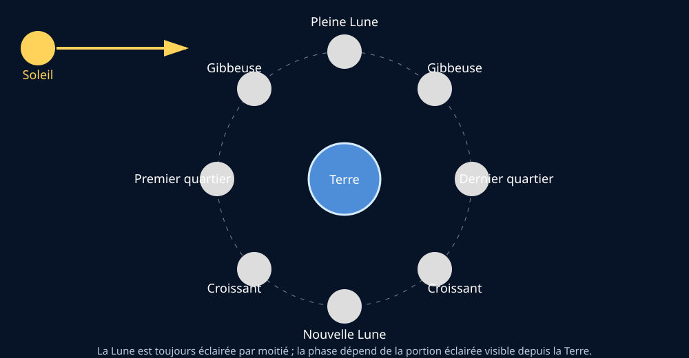
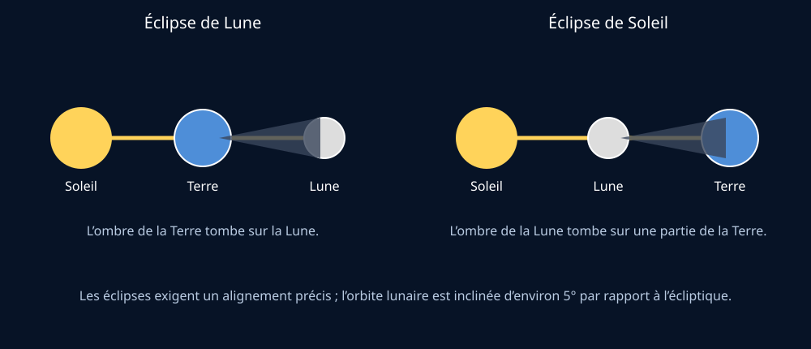
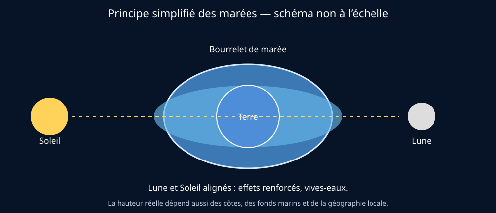

# Module 4 — La Lune et ses effets

## Source

- **Document :** `Astronomie.pdf — Introduction à l’astronomie`
- **Édition :** 2024
- **Pages :** 8–11 du document PDF
- **Source Drive :** [Astronomie.pdf](https://drive.google.com/file/d/1VKdzcqjsHL7iiYPSFOkPYnqRRlyCM-Fq/view?usp=drivesdk)

## Supports visuels

### Schémas pédagogiques originaux

*Figure 1 — Les phases dépendent de la portion éclairée visible depuis la Terre. Schéma original créé pour ce support par Gérard ; non à l’échelle.*

*Figure 2 — Comparaison des deux alignements. Schéma original créé pour ce support par Gérard ; non à l’échelle.*

*Figure 3 — Bourrelets de marée et alignement Soleil–Terre–Lune. Schéma original créé pour ce support ; non à l’échelle. La géographie locale modifie fortement les hauteurs observées.*

## Ressources visuelles externes

Ces ressources complètent le syllabus sans en modifier le contenu principal :

- [Phases de la Lune — NASA Science](https://science.nasa.gov/moon/moon-phases/)
- [Éclipses et la Lune — NASA Science](https://science.nasa.gov/moon/eclipses/)
- [Schémas et animations sur les marées — NASA](https://science.nasa.gov/resource/tides/)
- [Qu’est-ce qu’une éclipse ? — ESA](https://www.esa.int/Science_Exploration/Space_Science/What_is_an_eclipse)
- [Activité pédagogique sur les phases — NASA JPL Education](https://www.jpl.nasa.gov/edu/resources/lesson-plan/moon-phases/)
- [Galerie de paysages lunaires — NASA](https://science.nasa.gov/moon/image-galleries/moonscapes/)

Les pages NASA et ESA sont des ressources institutionnelles. Pour toute réutilisation hors de ce wiki, vérifier les conditions et crédits indiqués sur la page source. Les schémas originaux ci-dessus peuvent être réutilisés dans tes supports de formation en conservant leur légende.

## Objectifs

À la fin de ce module, je dois pouvoir :

- citer les principales caractéristiques de la Lune ;
- expliquer pourquoi elle nous montre toujours la même face ;
- expliquer l’origine des phases lunaires ;
- distinguer éclipse de Lune et éclipse de Soleil ;
- expliquer pourquoi les éclipses ne se produisent pas chaque mois ;
- expliquer le principe des marées ;
- distinguer vives-eaux et mortes-eaux ;
- présenter avec prudence les hypothèses sur la formation de la Lune.

## 1. La Lune, satellite naturel de la Terre

La Lune est le satellite naturel de la Terre. Le document indique une distance moyenne d’environ **384 400 km**. Elle est sphérique, mais se distingue de la Terre par plusieurs caractéristiques présentées dans le syllabus :

- absence d’atmosphère significative ;
- absence d’eau liquide en surface ;
- diamètre environ quatre fois plus petit que celui de la Terre ;
- absence de champ magnétique global comparable à celui de la Terre.

Sa surface présente des terrains clairs, des mers lunaires sombres et de nombreux cratères d’impact. L’absence d’atmosphère et d’érosion importante permet à des cratères très anciens de rester visibles.

### Point de vocabulaire

Les **mers lunaires** ne sont pas des mers d’eau. Ce sont d’anciennes étendues de roches volcaniques plus sombres.

## 2. Pourquoi la Lune nous montre-t-elle toujours la même face ?

La Lune tourne sur elle-même et tourne autour de la Terre. Ces deux mouvements ont la même durée : on parle de **rotation synchrone** ou de verrouillage gravitationnel.

Cette situation explique que, depuis la Terre, nous voyions toujours la même face générale de la Lune. Elle ne signifie pas que la face opposée reste toujours dans l’obscurité : au cours de sa révolution, toutes les régions lunaires reçoivent de la lumière solaire.

**Formulation simple pour le public :** la Lune tourne bien sur elle-même ; elle tourne simplement au même rythme qu’elle fait le tour de la Terre.

## 3. Les phases lunaires

La Lune est éclairée par le Soleil. Depuis la Terre, nous voyons une portion variable de sa moitié éclairée selon la position de la Lune sur son orbite.

La phase dépend donc de l’angle apparent entre le Soleil et la Lune, et non de l’ombre de la Terre — sauf dans le cas particulier d’une éclipse lunaire.

### Ordre des principales phases

Le cycle présenté dans le document suit cet ordre :

1. Nouvelle Lune ;
2. premier croissant ;
3. premier quartier ;
4. Lune gibbeuse croissante ;
5. Pleine Lune ;
6. Lune gibbeuse décroissante ;
7. dernier quartier ;
8. dernier croissant ;
9. nouvelle Lune suivante.

La **Nouvelle Lune** est généralement invisible, sauf situation particulière comme une éclipse solaire. À la **Pleine Lune**, la face visible est largement éclairée.

### Le terminateur

Le **terminateu**r est la limite apparente entre la partie éclairée et la partie non éclairée de la Lune. La lumière y arrive de manière rasante, ce qui met particulièrement bien en évidence le relief et les cratères.

## 4. Les éclipses

### Éclipse de Lune

Une éclipse de Lune se produit lorsque la Terre se trouve entre le Soleil et la Lune. La Lune traverse alors l’ombre ou la pénombre de la Terre. Cette configuration ne peut se produire qu’à la Pleine Lune.

### Éclipse de Soleil

Une éclipse de Soleil se produit lorsque la Lune se trouve entre le Soleil et la Terre. Une partie de la Terre traverse alors l’ombre ou la pénombre de la Lune. Cette configuration ne peut se produire qu’à la Nouvelle Lune.

### Totale, partielle et annulaire

- **Totale :** la source lumineuse est entièrement masquée depuis une zone donnée.
- **Partielle :** la source n’est pas entièrement masquée.
- **Annulaire :** la Lune est alignée avec le Soleil mais son diamètre apparent est insuffisant pour le masquer complètement ; un anneau lumineux reste visible.

### Pourquoi pas une éclipse chaque mois ?

Le plan de l’orbite lunaire est incliné d’environ **5°09’** par rapport au plan de l’orbite terrestre, appelé écliptique. Les deux plans se croisent en deux points appelés **nœuds**. Une éclipse ne peut se produire que lorsque la Lune passe suffisamment près d’un nœud au moment de l’alignement.

## 5. Les marées

La Lune exerce une attraction gravitationnelle sur la Terre. Les masses d’eau, plus mobiles que les masses rocheuses, réagissent davantage à cette attraction. Le Soleil agit également, avec un effet de marée présenté comme plus faible que celui de la Lune dans le document.

### Syzygie et vives-eaux

Lorsque le Soleil, la Terre et la Lune sont alignés, on parle de **syzygie**. Cela se produit autour de la Nouvelle Lune et de la Pleine Lune. Les effets du Soleil et de la Lune se renforcent : ce sont les **marées de vives-eaux**.

### Quadrature et mortes-eaux

Lorsque le Soleil, la Terre et la Lune forment approximativement un angle droit, on parle de **quadrature**. Cela correspond aux quartiers de Lune. Les effets des deux astres se contrarient davantage : ce sont les **marées de mortes-eaux**.

### Réserve importante

L’amplitude réellement observée dépend fortement de la forme des côtes, de la profondeur, des bassins marins et de la configuration locale. Le mécanisme astronomique ne suffit pas à lui seul à prévoir la hauteur d’une marée dans un port donné.

## 6. La formation de la Lune

Le document présente l’hypothèse dominante d’un impact géant : une protoplanète appelée Théia aurait percuté la Terre primitive. Des matériaux terrestres et de l’impacteur auraient été projetés en orbite, puis se seraient rassemblés pour former la Lune.

Cette présentation doit être formulée comme une **hypothèse scientifique dominante**, et non comme une observation directe de l’événement. Les roches lunaires rapportées par les missions Apollo ont fourni des indices importants sur les similitudes entre la Terre et la Lune.

## 7. Ce que le document dit des croyances lunaires

Le syllabus distingue l’influence gravitationnelle réelle de la Lune — notamment sur les marées — des croyances attribuant aux phases ou à la position zodiacale de la Lune une influence directe sur les cultures.

La lumière de la Pleine Lune est très faible comparée aux niveaux lumineux nécessaires à la photosynthèse. Les noms populaires de certaines pleines lunes ne décrivent pas une couleur physique particulière de la Lune.

**Conseil de guide :** corriger une croyance sans ridiculiser la personne. On peut reconnaître l’origine culturelle d’une pratique, puis distinguer cette tradition de ce qui est établi par l’observation et les mécanismes physiques.

## Démonstrations pédagogiques

### Phases avec trois objets

- lampe : Soleil ;
- balle : Lune ;
- observateur : Terre.

Faire tourner la balle autour de l’observateur en gardant une moitié éclairée par la lampe permet de montrer que les phases sont des variations de la portion éclairée visible.

### Éclipse avec trois objets

Aligner les trois objets pour montrer séparément :

- Terre entre Soleil et Lune : éclipse de Lune ;
- Lune entre Soleil et Terre : éclipse de Soleil.

Incliner légèrement le plan de l’orbite de la balle permet ensuite d’expliquer pourquoi l’alignement exact n’a pas lieu chaque mois.

Ces démonstrations sont des adaptations pédagogiques de Gérard et non une reproduction des figures du document.

## Questions fréquentes

**La face cachée est-elle toujours dans le noir ?**  
Non. La face cachée est la face que nous ne voyons pas depuis la Terre ; elle reçoit aussi la lumière du Soleil au cours de la rotation et de la révolution de la Lune.

**Les phases sont-elles causées par l’ombre de la Terre ?**  
Non. Elles résultent de la portion éclairée que nous voyons. L’ombre de la Terre intervient lors d’une éclipse de Lune.

**Pourquoi y a-t-il parfois une éclipse solaire à la Nouvelle Lune, mais pas à chaque Nouvelle Lune ?**  
Parce que l’orbite lunaire est inclinée par rapport à l’écliptique. L’alignement doit se produire près d’un nœud orbital.

**La Lune fait-elle monter l’eau partout de la même manière ?**  
Non. L’amplitude dépend aussi de la géographie et de la dynamique des bassins marins.

## Fiche de validation

- [ ] Je peux expliquer la rotation synchrone.
- [ ] Je peux dessiner les principales phases.
- [ ] Je ne confonds pas phase et éclipse.
- [ ] Je peux distinguer éclipse solaire et éclipse lunaire.
- [ ] Je peux expliquer le rôle de l’inclinaison orbitale.
- [ ] Je peux définir syzygie, quadrature, vives-eaux et mortes-eaux.
- [ ] Je peux présenter l’hypothèse de l’impact géant avec le bon niveau de prudence.
- [ ] Je peux répondre aux croyances lunaires avec respect et rigueur.

## Traçabilité

Cette fiche synthétise les pages 8–11 de `Astronomie.pdf`. Les démonstrations, formulations destinées au public et questions-réponses sont des adaptations pédagogiques. Les données locales de marée et toute précision dépassant le niveau du syllabus doivent être vérifiées dans une source spécialisée ou auprès du formateur.

## Contenu complet du guide — reprise structurée

> Cette partie reprend l’intégralité du texte du guide pour les pages de ce module, réorganisée en paragraphes lisibles. Les ajouts de Gérard sont placés dans les autres sections de la fiche.

### Contenu source — page 8

4. La Lune et ses effets

Située à une distance moyenne de 384 400 km, la Lune est notre satellite. Lorsqu’elle trône dans le ciel, il est difficile de la manquer.

C’est un corps céleste sphérique, qui comporte quelques similitudes avec la Terre, mais de nom­ breuses différences :

v   il n’y a pas d’atmosphère sur la Lune ;

v   il n’y a pas d’eau liquide sur la Lune ;

v   la Lune est plus petite que la Terre : son dia­ mètre est 4 fois plus petit ;

v   il n’y a pas de champ magnétique sur la Lune.

La Lune nous montre toujours la même face. Qu’on la regarde quand elle est pleine, gibbeuse ou en crois­ sant, elle va toujours nous présenter la même face. La Lune tourne donc autour de la Terre, mais en rotation synchronisée : sa rotation et sa révolution ont la même durée. Cependant, de la Lune, on peut voir toutes les régions terrestres défiler !

Figure 9. Cycle de la lunaison. a. révolution de la Lune autour de la Terre ; b. faces visibles de la Lune reprises dans le texte.

Le cycle de la lunaison est toujours le même et les dif­ férentes phases de la Lune se succèdent toujours dans le même ordre :

1. Nouvelle Lune : Lune invisible sauf lors d’une éclipse solaire) ;

2. premier croissant ;

La face visible de la Lune est marquée par des mers lunaires volcaniques sombres qui remplissent les es­ paces entre les hautes terres claires (certaines attei­ gnant 9 km d’altitude) et ses cratères d’impact proé­ minents. La face cachée de la Lune présente moins de mers mais beaucoup plus de cratères.

Étant donné l’absence d’atmosphère, ces cratères ne s’érodent pas, et de très vieux cratères restent tou­ jours visibles. Les plus vieux datent d’il y a 4 milliards d’années.

4.1. Les phases de la Lune

Les phases lunaires découlent du fait que la Lune (bien évidemment éclairée à moitié par la lumière solaire) nous présente des portions variablement éclairées de sa surface visible de par sa révolution autour de la Terre (fig. 9).

En effet, au fil des jours, un observateur terrestre voit l’angle formé entre le Soleil et la Lune changer constamment. Quand la Lune et le Soleil sont dans la même direction, cet angle est nul. C’est la Nouvelle Lune. Un angle de 180° (la Lune diamétralement op­ posée au Soleil) nous donnera la Pleine Lune, 90° un quartier, etc.

Orion8 (wikipedia ; CC BY-SA 3.0)

3. premier quartier ;

4. Lune gibbeuse croissante ;

5. Pleine Lune ;

6. Lune gibbeuse décroissante ;

7. dernier quartier ;

8. dernier croissant ;

9. Nouvelle Lune du cycle suivant.

### Contenu source — page 9

Sur la Lune, comme sur d’autres astres, la zone li­ néaire floue qui sépare la partie éclairée de la partie non éclairée se nomme « le terminateur ». C’est là que la lumière est rasante et donc le meilleur endroit pour voir son relief dont les cratères.

Observée basse sur l’horizon, la Lune apparaît plus grosse. C’est un effet d’optique dû au fait qu’il y a des repères visuels (arbres, maisons…) qui permettent la comparaison des tailles angulaires.

4.2. Les éclipses

Une éclipse de Lune se produit lorsque la Terre se trouve entre le Soleil et la Lune, ce qui ne peut se passer que lors d’une Pleine Lune (fig. 10). La Lune se trouve alors dans l’ombre de la Terre.

Une éclipse de Soleil se produit lorsque la Lune se trouve entre le Soleil et la Terre, ce qui ne peut se passer que lors d’une Nouvelle Lune. Une partie de la Terre se trouve alors dans l’ombre ou la pénombre de la Lune.

Looxix (wikipedia ; CC BY-SA 3.0) Daniel M. Daniel M. Short (wikimedia ; CC-BY-SA-2.5)

Figure 10. Éclipse de Lune. a. ombre ; b. pénombre.

Une éclipse peut être totale ou partielle (encadré 3), selon que la source de lumière est entièrement blo­ quée par l’objet éclipsant, ou que l’objet éclipsant ne bloque pas entièrement la lumière provenant de la source.

Encadré 3. Éclipse annulaire.

Une éclipse annulaire est un cas particulier d’éclipse partielle (de fait, puisque non totale) où les trois objets concernés sont parfaitement ali­ gnés (éclipse centrale), mais où l’objet éclipsant est trop petit (ou l’objet éclipsé trop gros) pour bloquer complètement la source de lumière : il reste alors un anneau lumineux encore visible.

C’est une situation relativement fréquente pour les éclipses de Soleil car même si la Lune et le So­ leil ont quasiment la même taille apparente vus de la Terre, selon leurs distances respectives à la Terre, une faible différence de diamètre apparent (de l’ordre de quelques pourcents) est perceptible.

À partir de la Terre, une éclipse n’est possible que lorsque le Soleil, la Lune et la Terre sont alignés.

Si le plan de l’orbite de la Lune coïncidait avec celui de la Terre, appelé l’écliptique, il y aurait une éclipse de Soleil et une éclipse de Lune chaque mois lunaire. Comme ces deux plans sont inclinés d’un angle de 5°09’, il faut que la Lune soit à proximité d’un des deux points d’intersec­ tion de ces plans, points appelés nœuds, pour qu’une éclipse puisse se produire (fig. 11).

Figure 11. Plans d’orbites. En bleu, plan orbital de la Lune ; en gris, plan orbital ou écliptique, de la Terre ; en rouge, orbite apparente du Soleil ; en noir, orbite de la Lune ; points noirs, nœuds ; point bleu, la Terre.

4.3. Les marées

Seul le principe de base des marées est expliqué. La Lune ayant une masse, elle va avoir un effet gravita­ tionnel sur la surface de la Terre. Cela implique qu’elle va attirer à elle la Terre et tout ce qui se trouve à sa surface. Les masses d’eau, ayant plus de facilités à bouger, vont alors se soulever au passage de la Lune.

Les masses terrestres bougent un peu, mais l’effet est plus petit (de l’ordre de 30 cm pour les marées ter­ restres, par rapport à plusieurs mètres, voire une di­ zaine de mètres pour les marées d’eau).

### Contenu source — page 10

À noter que l’atmosphère subit également l’influence des marées.

Mais la Lune n’est pas le seul objet à influencer notre Terre par gravité. Le Soleil va attirer aussi les masses, mais avec une intensité plus faible de l’ordre du tiers par rapport à la Lune. On pourra donc distinguer deux cas (fig. 12) :

1. quand la Terre, le Soleil et la Lune sont alignés (fig. 12a) : on dit qu’ils sont en syzygie ;

2. quand la Terre, le Soleil et la Lune forment un angle droit (fig. 12b) : on dit qu’ils sont en quadra­ ture.

a

b Très naturellement, les recommandations de l’uti­ lisation de la lune ont été traduites dans des ca­ lendriers de jardinage dont un exemple figure déjà dans la Maison Rustique rédigé en 1583 . Cepen­ dant, ces pratiques commencent à être mises en doute, à des degrés divers, par les agronomes du XVIIe et XVIIIe siècles. Olivier de Serre s’interroge en remarquant que les traditions sont quelquefois contradictoires selon les régions : « les jardiniers d’Avignon et ceux de Nîmes quoique sous le même climat, ne sont pas d’accord sur tout : faisant heu­ reusement les uns en une lune, ce que de même les autres font en une autre ». L’auteur indique aussi que certains sont sceptiques et ne tiennent pas compte des traditions et dans ses recomman­ dations, il considère plus sage de se référer aux pratiques locales.

MesserWoland (wikimedia ; CC BY-SA 3.0)

Figure 12. Mécanisme des marées. En jaune, le Soleil ; en bleu foncé, la surface solide de la Terre ; en bleu clair, la surface liquide de la Terre ; en gris, la Lune ; flèche rouge, sens de l’attraction par le Soleil ou la Lune. a. syzygie ; b. quadrature.

Les marées seront plus importantes lorsque la Terre, la Lune et le Soleil seront en syzygie. Ils attirent dans le même axe, la même direction mais dans des sens op­ posés. On dit alors de la marée qu’elle est « de vives- eaux ». C’est le moment de la Pleine Lune ou de la Nou­ velle Lune.

Au contraire, lors de la quadrature, on verra la Lune dans son premier quartier ou dans son dernier quar­ tier, et la marée ne sera pas très importante. On ap­ pelle ces marées « mortes-eaux ». La direction de l’at­ traction de la Lune et de celle du Soleil sont alors à 90°.

4.4. La création de la Lune

L’exploration de la Lune (début : en juillet 1969, les différentes missions Apollo ont ramené près de 382 kg de roches lunaires) a permis de déterminer que les roches lunaires étaient de compositions très sem­ blables à celles de la Terre.

Depuis, l’hypothèse dominante est qu’une protopla­ nète (Théia) est venue heurter la Terre peu après la formation du Système solaire (fig. 13). L’impacteur, la croûte et une partie du manteau terrestre se sont disloqués et ont projeté une grande quantité de débris en orbite autour de la Terre. Ensuite, la Lune s’est for­ mée par l’accrétion d’une partie de ce nuage de débris en un temps très court, de l’ordre d’un siècle.

Citronade (wikimedia ; CC BY-SA 4.0)

Figure 13. Étapes de la formation de la Lune.

Encadré 4. Et le jardin dans tout ça ?

Coupons court au suspense, la science est claire à ce sujet : il n’y a pas d’influence directe de la lune sur les cultures, en dehors bien évidemment des zones côtières et des abords de grands fleuves car la Lune est responsable, en grande partie, des

### Contenu source — page 11

phénomènes de marées. De par sa masse, ce sa­ tellite exerce un effet gravitationnel sur la surface de la terre, c’est-à-dire qu’elle va attirer à elle la Terre et tout ce qui se trouve à sa surface. Les masses d’eau étant plus mobiles, elles vont se dé­ placer au passage de la lune car si les masses de terre bougent peu, de l’ordre de 30 centimètres, les masses d’eau vont bouger de plusieurs mètres voire dizaines de mètres.

On observe un effet très important des marées sur les océans, mais bien moindre sur les mers (citons par exemple la mer Méditerranée, dont les marées sont assez faibles (environ 30cm , rajouter source), et aucun sur les lacs ou les étangs. Ceci s’explique par le fait que l’influence de la Lune ne soulève pas l’eau, mais la déplace. Pour voir un grand déplace­ ment, il faudra donc une grande surface d’eau.

Dans un potager, la surface de l’eau contenue dans un verre d’eau, ou dans une salade, étant encore plus petite que celle d’un lac, elle subira encore moins l’influence de la Lune.

Quant à la luminosité de la lune : même pleine, elle ne dépasse pas 0.5 lux. Or la photosynthèse ne se produit qu’à partir d’une valeur dépassant les 5 lux et celle-ci est à son maximum aux alentours d’une valeur de 10 000 lux.

Certains imaginent également une influence de la position de la Lune vis à vis du zodiaque. Mais les constellations du zodiaques sont composées d’étoiles très lointaines, sans lien les unes avec les autres à part dans notre imagination, certaines étant situées beaucoup plus loin que d’autres. Ces constellations ont d’ailleurs des tailles diffé­ rentes dans le ciel, et l’écliptique, cette zone où se baladent les planètes, la Lune et le Soleil, est traversée non par 12 constellations, mais par 13. Les maisons zodiacales ne sont également plus ali­ gnées (depuis deux millénaires) avec les constella­ tions portant le même nom. La position de la Lune, vis à vis des étoiles lointaines, a beaucoup moins d’influence sur Terre que sa phase, qui influence les marées.

Quid des « lunes rousses, bleues, ultra-violettes et chocolat à petits pois vert » ? Ce ne sont que des termes qui n’ont pas de réel lien avec une quelconque couleur de la lune. Elles sont juste une nomenclature d’astrologues, ayant ressenti

le besoin de nommer chaque pleine Lune de l’an­ née. Oui, planter vos petits pois en janvier, juin ou septembre vous donnera des résultats différents, mais toujours aucun lien avec la Lune.
