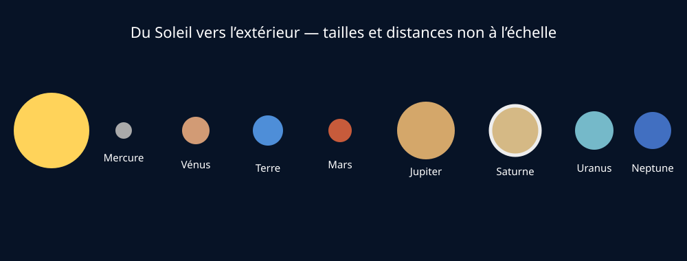

# Module 5 — Le Système solaire

## Source

- **Document :** `Astronomie.pdf — Introduction à l’astronomie`
- **Pages :** 12–18 du PDF
- **Source Drive :** [Astronomie.pdf](https://drive.google.com/file/d/1VKdzcqjsHL7iiYPSFOkPYnqRRlyCM-Fq/view?usp=drivesdk)

## Support visuel

*Figure 1 — Ordre des planètes depuis le Soleil ; tailles et distances non à l’échelle. Schéma original créé pour ce support.*

## Objectifs

- caractériser le Soleil ;
- définir une planète ;
- citer une particularité des huit planètes ;
- reconnaître Mars, Jupiter et Saturne ;
- expliquer le statut de Pluton ;
- distinguer astéroïde et comète.

## Le Soleil

Le Soleil est une étoile, source de lumière et de chaleur pour la Terre. Le syllabus indique une température de surface d’environ 5 000 °C, une température centrale d’environ 15 millions de degrés, une distance moyenne de 150 millions de kilomètres et un âge d’environ 4,6 milliards d’années. Il est principalement composé d’hydrogène et d’hélium et produit un vent solaire.

## Définir une planète

Dans le cadre présenté par le document, une planète est un objet sphérique qui orbite autour du Soleil et a éliminé les corps voisins de son orbite. Le Système solaire compte huit planètes, dans l’ordre : Mercure, Vénus, Terre, Mars, Jupiter, Saturne, Uranus et Neptune.

### Planètes rocheuses

- **Mercure :** proche du Soleil, sans atmosphère significative, fortes variations thermiques ; observation surtout à l’aube ou au crépuscule.
- **Vénus :** taille proche de celle de la Terre, atmosphère dense riche en CO₂, effet de serre intense et température de surface très élevée.
- **Terre :** atmosphère et conditions permettant la vie connue.
- **Mars :** atmosphère ténue, couleur rouge liée aux oxydes de fer, volcans et canyons remarquables, deux petits satellites.

### Planètes géantes

- **Jupiter :** plus grande planète, grande tache rouge, lunes galiléennes visibles aux jumelles dans de bonnes conditions.
- **Saturne :** anneaux très caractéristiques, constitués principalement de glace et de particules.
- **Uranus :** teinte verdâtre, axe de rotation fortement incliné, anneaux et satellites.
- **Neptune :** planète la plus éloignée du Soleil, teinte bleue liée notamment au méthane, atmosphère active.

Les valeurs du tableau comparatif du syllabus sont à utiliser comme ordres de grandeur et à vérifier contre une source astronomique actuelle si elles sont reprises dans un support public.

## Pluton, astéroïdes et comètes

Pluton est une planète naine depuis 2006 : elle est sphérique et orbite autour du Soleil, mais ne satisfait pas le critère de nettoyage de son voisinage orbital.

Un **astéroïde** est un petit corps rocheux, métallique ou glacé, généralement irrégulier. Une **comète** possède un noyau de glace et de poussières ; lorsqu’elle s’approche du Soleil, elle peut développer une coma et une ou plusieurs queues.

## Observation et pédagogie

- Mercure et Vénus sont des planètes intérieures : elles restent proches du Soleil dans le ciel et ne sont pas visibles toute la nuit.
- Jupiter et Saturne sont de bons objets de présentation au public lorsqu’elles sont visibles.
- Une maquette du Système solaire doit préciser si les tailles ou les distances sont à l’échelle : on ne peut généralement pas représenter les deux correctement sur une même page.

## Ressources complémentaires

- [Our Solar System — NASA](https://science.nasa.gov/resource/our-solar-system/)
- [Our Solar System Poster — NASA](https://science.nasa.gov/resource/our-solar-system-poster-version-a/)
- [Solar System and Beyond Poster Set — NASA](https://nasa.gov/stem-content/solar-system-and-beyond-poster-set)

## Fiche de validation

- [ ] Je sais réciter l’ordre des huit planètes.
- [ ] Je peux distinguer planètes rocheuses et géantes.
- [ ] Je peux expliquer pourquoi Pluton est une planète naine.
- [ ] Je peux reconnaître un astéroïde et une comète sur une description.
- [ ] Je peux expliquer pourquoi Mercure et Vénus ne sont jamais visibles au milieu de la nuit.
