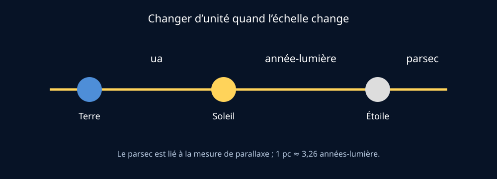

# Module 6 — Mesurer les distances dans l’espace

## Source

- **Document :** `Astronomie.pdf — Introduction à l’astronomie`
- **Pages :** 19–20 du PDF
- **Source Drive :** [Astronomie.pdf](https://drive.google.com/file/d/1VKdzcqjsHL7iiYPSFOkPYnqRRlyCM-Fq/view?usp=drivesdk)

## Support visuel

*Figure 1 — Choisir l’unité selon l’échelle étudiée. Schéma original créé pour ce support.*

## Objectif

Employer l’unité adaptée à l’échelle de l’objet observé : unité astronomique, seconde ou année-lumière, et parsec.

## Les unités

### Unité astronomique — ua

Une unité astronomique correspond approximativement à la distance moyenne entre la Terre et le Soleil, soit environ 150 millions de kilomètres. Elle convient aux distances du Système solaire : Terre–Soleil = 1 ua, Jupiter ≈ 5,2 ua, Pluton ≈ 39,9 ua.

### Année-lumière

Une année-lumière est une distance, pas une durée : c’est la distance parcourue par la lumière en une année. Le document rappelle que la lumière met environ 1,3 seconde entre la Terre et la Lune et environ 8,3 minutes entre le Soleil et la Terre.

### Parsec

Le parsec est lié à la parallaxe. Une étoile proche semble légèrement se déplacer par rapport aux étoiles lointaines lorsque la position d’observation change au cours de la révolution terrestre. Le syllabus donne : **1 parsec ≈ 3,2616 années-lumière**.

## Démonstration de parallaxe

Tendre le pouce à bout de bras devant un arrière-plan lointain, puis fermer alternativement chaque œil, permet de visualiser le déplacement apparent dû au changement de point de vue. Le phénomène astronomique utilise une base beaucoup plus grande : le déplacement de la Terre autour du Soleil.

## Ordres de grandeur à retenir

- Terre–Lune : environ 1,3 seconde-lumière ;
- Terre–Soleil : environ 8,3 minutes-lumière ;
- Proxima du Centaure : plusieurs années-lumière ;
- distance dans la Voie lactée : milliers à dizaines de milliers d’années-lumière.

## Ressources complémentaires

- [Reference Systems — NASA Science](https://science.nasa.gov/learn/basics-of-space-flight/chapter2-1/)
- [Modeling the Earth-Moon System — NASA JPL Education](https://www.jpl.nasa.gov/edu/resources/lesson-plan/modeling-the-earth-moon-system/)
- [Seeing the Earth, Moon, and Sun to Scale — NASA](https://www.grc.nasa.gov/www/k-12/Numbers/Math/Mathematical_Thinking/seeing_the_earth_moon.htm)

## Fiche de validation

- [ ] Je sais quand utiliser ua, année-lumière et parsec.
- [ ] Je ne confonds pas année-lumière et durée.
- [ ] Je peux expliquer la parallaxe avec une démonstration simple.
- [ ] Je peux donner trois ordres de grandeur de distance dans l’espace.
