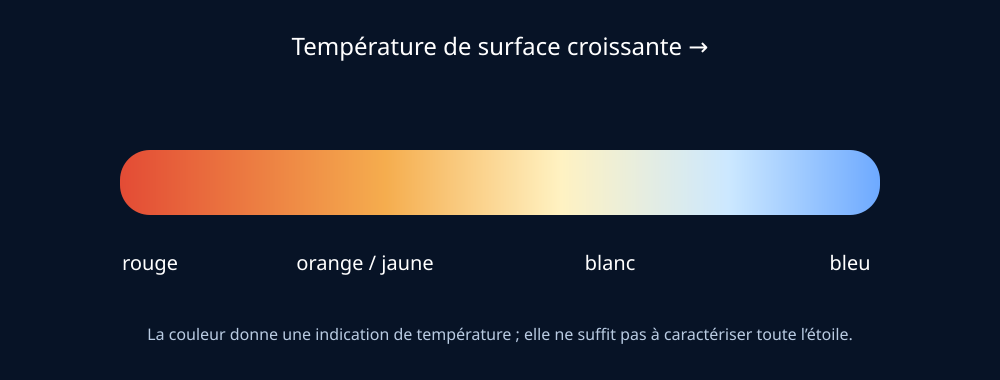

# Module 7 — Les étoiles

## Source

- **Document :** `Astronomie.pdf — Introduction à l’astronomie`
- **Pages :** 21–22 du PDF
- **Source Drive :** [Astronomie.pdf](https://drive.google.com/file/d/1VKdzcqjsHL7iiYPSFOkPYnqRRlyCM-Fq/view?usp=drivesdk)

## Support visuel

*Figure 1 — Relation indicative entre couleur et température de surface. Schéma original ; la couleur observée dépend aussi des conditions d’observation.*

## Qu’est-ce qu’une étoile ?

Une étoile est une sphère massive et lumineuse de plasma dont le cœur atteint les conditions nécessaires aux réactions de fusion nucléaire. Les étoiles fusionnent principalement l’hydrogène en hélium. Des étoiles plus massives ou plus évoluées peuvent produire des éléments plus lourds.

La masse influence fortement la luminosité, la température, la durée de vie et l’évolution d’une étoile. Une étoile massive peut être plus lumineuse mais consommer son combustible plus rapidement.

## Couleur et température

La couleur apparente est liée à la température de surface : les étoiles les plus froides apparaissent plutôt rouges, puis la couleur évolue vers le jaune, le blanc et le bleu pour les températures plus élevées. Le Soleil est présenté comme une naine jaune de type spectral G2.

## Magnitude

La magnitude est une mesure de luminosité apparente ou intrinsèque :

- **magnitude apparente :** éclat observé depuis la Terre, dépendant notamment de la distance ;
- **magnitude absolue :** luminosité intrinsèque ramenée à une distance de référence.

L’échelle est inversée : une magnitude 1 correspond à un astre plus brillant qu’une magnitude 6. La magnitude limite dépend fortement du ciel, de l’instrument et des conditions d’observation.

## Réponses pour le public

- Une planète ne produit pas sa propre lumière visible comme une étoile ; elle réfléchit principalement la lumière de son étoile.
- Une étoile peut paraître faible parce qu’elle est peu lumineuse, lointaine, ou les deux.
- La couleur donne une indication de température, mais une observation visuelle ne fournit pas à elle seule toutes les propriétés physiques d’une étoile.

## Ressources complémentaires

- [Stars — NASA Space Place](https://spaceplace.nasa.gov/stars/)
- [What Are Stars? — NASA Science](https://science.nasa.gov/universe/stars/)
- [Stellar classification — ESA](https://www.esa.int/Science_Exploration/Space_Science)

## Fiche de validation

- [ ] Je peux définir une étoile.
- [ ] Je peux expliquer le rôle de la fusion nucléaire.
- [ ] Je peux relier couleur et température avec prudence.
- [ ] Je distingue magnitude apparente et absolue.
- [ ] Je sais que l’échelle des magnitudes est inversée.
