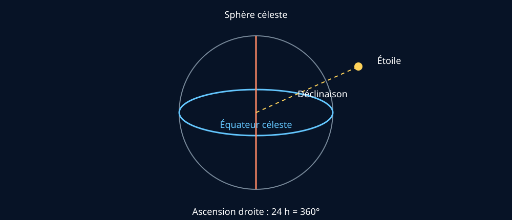

# Module 8 — Les constellations et les coordonnées célestes

## Source

- **Document :** `Astronomie.pdf — Introduction à l’astronomie`
- **Pages :** 23–25 du PDF
- **Source Drive :** [Astronomie.pdf](https://drive.google.com/file/d/1VKdzcqjsHL7iiYPSFOkPYnqRRlyCM-Fq/view?usp=drivesdk)

## Support visuel

*Figure 1 — Déclinaison et ascension droite sur la sphère céleste. Schéma original simplifié et non à l’échelle.*

## Astérismes et constellations

Un astérisme est une figure reconnaissable formée par des étoiles vues depuis la Terre. Les étoiles d’une même figure peuvent être très éloignées les unes des autres et n’avoir aucun lien physique. Les constellations constituent surtout un système culturel et pratique de repérage du ciel.

Le ciel est officiellement divisé en 88 constellations. Le guide doit distinguer une constellation officielle d’un astérisme connu, comme la Grande Ourse.

## Constellations utiles pour débuter

La Grande Ourse, la Petite Ourse, Cassiopée et Orion sont des repères importants pour la formation. Les constellations circumpolaires restent au-dessus de l’horizon selon la latitude du lieu.

## Coordonnées équatoriales

Le système équatorial projette sur la sphère céleste le système de coordonnées terrestres :

- **déclinaison :** analogue à la latitude, de −90° à +90° ;
- **ascension droite :** analogue à la longitude, exprimée en heures, minutes et secondes ; une heure correspond à 15°.

Le point vernal sert de référence à l’ascension droite. L’équateur céleste est la projection de l’équateur terrestre.

## Le zodiaque astronomique

L’écliptique est la trajectoire apparente annuelle du Soleil et correspond au plan orbital de la Terre. Le Soleil, la Lune et les planètes majeures se déplacent dans la zone zodiacale. Le document rappelle qu’elle traverse 13 constellations, dont Ophiuchus, alors que le zodiaque astrologique utilise généralement 12 signes.

Pour une animation, il est préférable de distinguer calmement : constellations observables, écliptique, signes astrologiques et interprétations culturelles.

## Ressources complémentaires

- [Reference Systems — NASA](https://science.nasa.gov/learn/basics-of-space-flight/chapter2-2)
- [Mapping the Sky — NASA Radio JOVE](https://radiojove.gsfc.nasa.gov/education/educationalcd/RadioAstronomyTutorial/Workbook%20PDF%20Files/Chapter7.pdf)
- [Stellarium Web](https://stellarium-web.org/)

## Fiche de validation

- [ ] Je distingue constellation et astérisme.
- [ ] Je peux retrouver les quatre constellations de base.
- [ ] Je peux définir déclinaison et ascension droite.
- [ ] Je peux expliquer le rôle de l’écliptique.
- [ ] Je peux distinguer zodiaque astronomique et astrologique sans confondre les deux.
