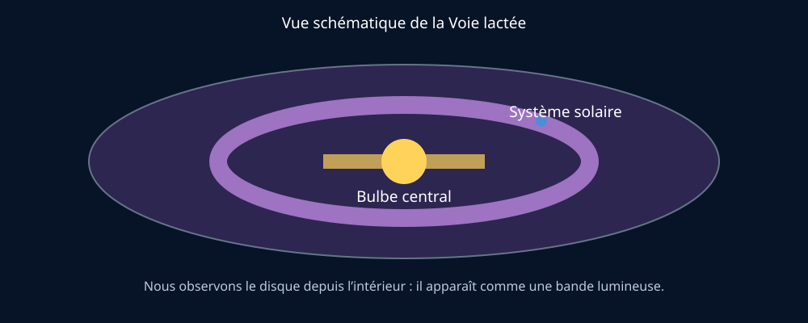

# Module 9 — La Voie lactée et les galaxies

## Source

- **Document :** `Astronomie.pdf — Introduction à l’astronomie`
- **Pages :** 26–27 du PDF
- **Source Drive :** [Astronomie.pdf](https://drive.google.com/file/d/1VKdzcqjsHL7iiYPSFOkPYnqRRlyCM-Fq/view?usp=drivesdk)

## Support visuel

*Figure 1 — Vue schématique de dessus ; nous observons la Galaxie depuis l’intérieur. Schéma original, non à l’échelle.*

## Notre galaxie

Une galaxie est un ensemble gravitationnel d’étoiles, de gaz et de poussières. Notre galaxie est la **Voie lactée**, une galaxie spirale barrée qui contient le Système solaire.

Depuis la Terre, nous observons la Voie lactée de l’intérieur. Elle apparaît comme une bande blanchâtre due à l’accumulation apparente d’étoiles que l’œil ne distingue pas individuellement. Depuis les latitudes septentrionales, nous observons principalement les régions extérieures du disque ; le centre galactique est plus favorablement visible depuis l’hémisphère Sud.

Le syllabus donne un ordre de grandeur de 200 à 400 milliards d’étoiles et situe le Système solaire à environ 27 000 années-lumière du centre galactique. Ces nombres doivent être présentés comme des estimations.

## Autres galaxies

Les galaxies peuvent être spirales, elliptiques ou irrégulières. Andromède est une galaxie spirale proche, vue sous un angle qui ne permet pas d’en distinguer facilement tous les bras.

La future interaction entre Andromède et la Voie lactée est un bon exemple de phénomène spectaculaire mais extrêmement lent. Une collision entre galaxies ne signifie pas que les étoiles vont nécessairement entrer directement en collision : les distances entre elles sont immenses.

## Supports d’animation

- Montrer une photographie de la Voie lactée et demander pourquoi elle forme une bande.
- Faire distinguer une photographie de galaxie vue de face et une galaxie vue par la tranche.
- Relier le sujet à la pollution lumineuse et aux conditions d’observation.

## Ressources complémentaires

- [Milky Way Galaxy — NASA Science](https://science.nasa.gov/universe/galaxies/milky-way/)
- [Galaxies — NASA Science](https://science.nasa.gov/universe/galaxies/)
- [Andromeda Galaxy — NASA](https://science.nasa.gov/missions/hubble/hubble-focuses-on-the-andromeda-galaxy/)

## Fiche de validation

- [ ] Je peux définir une galaxie.
- [ ] Je peux expliquer pourquoi la Voie lactée apparaît comme une bande.
- [ ] Je sais situer le Système solaire dans la Galaxie à grands traits.
- [ ] Je distingue galaxie spirale, elliptique et irrégulière.
- [ ] Je peux expliquer pourquoi une collision de galaxies ne signifie pas une collision fréquente d’étoiles.

## Contenu complet du guide — reprise structurée

> Cette partie reprend l’intégralité du texte du guide pour les pages de ce module, réorganisée en paragraphes lisibles. Les ajouts de Gérard sont placés dans les autres sections de la fiche.

### Contenu source — page 26

9. La Voie lactée : notre galaxie

Une galaxie est un gigantesque ensemble d’étoiles, de poussières et de gaz interstellaires dont la cohésion est assurée par la gravitation.

Notre galaxie s’appelle la Voie lactée, synonyme Ga­ laxie (avec un G majuscule), et est une galaxie spirale barrée (fig. 31). Elle comprend de 200 à 400 milliards d’étoiles, et au minimum 100 milliards de planètes. Elle abrite le Système solaire, et donc la Terre. Le Système solaire est situé à 27 000 années-lumière du centre de la Voie lactée, lequel est constitué d’un ou de plusieurs trous noirs supermassifs.

Notre galaxie, avec ses voisines, forment un amas ga­ lactique : l’Amas de la Vierge.

N. Risinger (domaine public)

Figure 31. Notre galaxie, la Voie lactée.

L’héliopause, avec son rayon de 20 milliards de km, est la limite où le vent solaire est arrêté par le milieu in­ terstellaire. C’est une sphère insignifiante au regard de la taille de notre galaxie !

La Voie lactée étant une sorte de disque muni de bras, observée depuis la Terre, elle ressemble à une bande blanchâtre. Bande parce que le Système solaire est situé à l’intérieur et blanchâtre en raison de l’accumu­

lation d’une multitude d’étoiles que l’on ne peut distin­ guer à l’œil nu (fig. 32).

Du côté de l’hémisphère Nord, nous pouvons obser­ ver principalement les bords extérieurs de la galaxie. Dans le ciel du Sud, on peut regarder vers l’intérieur, et vers le centre, son bulbe central. Cela implique que la Voie lactée est beaucoup plus lumineuse dans l’hé­ misphère Sud que dans celui du Nord.

CNB

Figure 32. Nous sommes à l’intérieur de notre galaxie. Difficile donc de prendre de la hauteur pour regarder à quoi elle ressemblerait, vue de l’extérieur.

9.1. Et les autres galaxies ?

On peut observer différents types de galaxies dans le ciel. Certaines sont également des galaxies spi­ rales, comme la nôtre. D’autres sont elliptiques, et certaines sont irrégulières. Nous ne pouvons pas tou­ jours observer les galaxies sous leur meilleur profil,

### Contenu source — page 27

c’est-à-dire de face (les galaxies spirales s’étendent principalement en deux dimensions). Ainsi, la galaxie d’Andromède, notre proche voisine, est une galaxie spirale, mais dont il est difficile de distinguer les bras, car on la voit presque par la tranche (en réalité sous un angle de 77°) (fig. 33 et 34) :

J.-P. Dumoulin et C. Wanlin

Figure 33. Galaxie d’Andromède (M31).

NASA/ESA and The Hubble Heritage Team (STScI/AURA) (Wikimedia ; domaine public)

Figure 34. Galaxie du Sombrero (M104) vue par la tranche par le té­ lescope spatial Hubble.

9.2. Notre galaxie va en heurter une autre !​

La galaxie la plus proche de la nôtre, Andromède, de­ vrait rencontrer la Voie lactée d’ici 4 milliards d’an­ nées.

Quand ces deux galaxies seront suffisamment proches, elles commenceront par se tourner autour. Elles vont ensuite s’échanger leurs gaz, leurs étoiles, et lentement se mêler pour ne plus former qu’une seule et même énorme galaxie dans sept milliards d’années.

Mais les interactions directes (les collisions éven­ tuelles) entre étoiles de galaxies en collision sont très improbables malgré l’énorme collision apparente.
