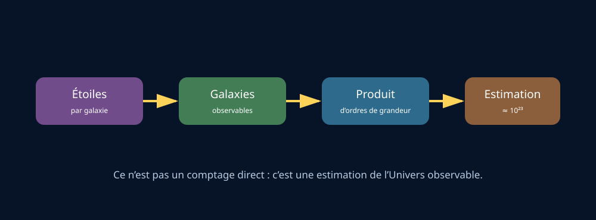

# Module 10 — Combien y a-t-il d’étoiles dans l’Univers ?

## Source

- **Document :** `Astronomie.pdf — Introduction à l’astronomie`
- **Pages :** 28–29 du PDF
- **Source Drive :** [Astronomie.pdf](https://drive.google.com/file/d/1VKdzcqjsHL7iiYPSFOkPYnqRRlyCM-Fq/view?usp=drivesdk)

## Support visuel

*Figure 1 — Chaîne d’estimation par ordres de grandeur. Schéma original ; le résultat est une estimation de l’Univers observable.*

## Une réponse honnête

Le nombre total d’étoiles dans l’Univers est inconnu, car la taille totale de l’Univers est inconnue et l’Univers pourrait être infini. On peut seulement estimer le nombre d’étoiles dans l’Univers observable.

## Méthode d’estimation

Le raisonnement du syllabus consiste à estimer :

1. le nombre moyen d’étoiles dans une galaxie ;
2. le nombre de galaxies dans l’Univers observable ;
3. le produit des deux ordres de grandeur.

Le document utilise une image profonde de Hubble, obtenue dans une petite région sombre du ciel, pour illustrer le nombre de galaxies visibles dans un champ minuscule. Il aboutit à un ordre de grandeur d’environ 10²³ étoiles dans l’Univers observable.

Ce résultat doit être présenté comme une estimation, pas comme un comptage direct.

## Univers observable

L’Univers observable correspond à la région dont la lumière a eu le temps de nous parvenir. Le syllabus donne un rayon d’environ 45 milliards d’années-lumière, tout en rappelant que l’âge de l’Univers est d’environ 13,8 milliards d’années : l’expansion de l’espace doit être prise en compte.

L’expansion ne signifie pas que l’Univers se dilate dans un espace extérieur simple. Il s’agit de l’évolution des distances au sein de l’espace lui-même.

## Ressources complémentaires

- [Hubble Deep Field — NASA/ESA](https://science.nasa.gov/mission/hubble/science/explore-the-night-sky/hubble-deep-fields/)
- [The observable universe — NASA WMAP](https://map.gsfc.nasa.gov/universe/uni_shape.html)
- [The expanding universe — NASA Science](https://science.nasa.gov/universe/)

## Fiche de validation

- [ ] Je distingue Univers et Univers observable.
- [ ] Je peux expliquer pourquoi le nombre total d’étoiles est inconnu.
- [ ] Je peux expliquer le principe d’une estimation par ordre de grandeur.
- [ ] Je peux parler de l’expansion sans utiliser l’image trompeuse d’un ballon dans un espace extérieur comme seule explication.

## Contenu complet du guide — reprise structurée

> Cette partie reprend l’intégralité du texte du guide pour les pages de ce module, réorganisée en paragraphes lisibles. Les ajouts de Gérard sont placés dans les autres sections de la fiche.

### Contenu source — page 28

10. Combien y a-t-il d’étoiles dans l’Univers ?

La réponse à cette question est très simple : on n’en sait rien ! On ne connaît pas la taille de l’Univers, peut- être même est-il infini ! En revanche, on peut se de­ mander combien il y a d’étoiles dans l’Univers obser­ vable. Pour cela, on calcule ça très simplement en se demandant :

v   combien une galaxie contient-elle d’étoiles (en moyenne) ?

v   combien y a-t-il de galaxies dans l’Univers ob­ servable ?

10.1. Combien de galaxies ?

La première question est assez simple, on sait par exemple que notre galaxie, la Voie lactée, contient entre 200 et 400 milliards d’étoiles. Ça fait déjà beau­ coup ! Si les Terriens décident de se partager la Voie lactée, cela veut dire que chacun d’entre nous recevra une quarantaine d’étoiles pour lui tout seul, et par la même occasion probablement quelques centaines de planètes !

La question du nombre de galaxies dans l’Univers ob­ servable est plus compliquée. Mais heureusement il y a Hubble. Entre 2003 et 2004, les astronomes ont pointé le télescope spatial Hubble dans un coin extrê­ mement sombre du ciel, et ont essayé de faire la photo la plus précise possible de ce qu’ils voyaient (fig. 35).

NASA and the European Space Agency (wikimedia ; domaine public)

Figure 35. Ciel profond vu par le télescope spatial Hubble.

La figure 35 montre ce que le télescope Hubble peut voir en regardant dans un tout petit coin sombre du ciel. En analysant finement toutes les données, les as­ tronomes ont pu identifier dans cette prise de vue pas moins de 10 000 galaxies ! Ce qui est bluffant, c’est que cette image ne couvre qu’un morceau minuscule du ciel : à peu près l’équivalent de la surface d’une tête d’épingle que vous tiendriez à bout de bras !

Pour être précis, le champ de vision de cette image est d’environ 0,04°, ce qui signifie qu’il faudrait faire en­ viron 23 millions de photos comme celle-ci pour cou­ vrir l’ensemble du ciel. Puisque l’on a trouvé 10 000 galaxies dans cette image, cela signifie qu’il y a certai­ nement au minimum 23 millions x 10 000 = 230 mil­ liards de galaxies. Comme c’est un calcul « en moyenne », on ne se trompera pas en disant qu’il y a quelques centaines de milliards de galaxies dans l’Univers ob­ servable.

Nous sommes au bout de notre calcul, s’il y a quelques centaines de milliards d’étoiles par galaxie et quelques centaines de milliards de galaxies, en faisant le produit des deux on trouve qu’il y a environ 1023 (10 puissance 23) étoiles dans notre Univers observable !

Il y aurait autant d’étoiles dans l’Univers observable que de grains de sable sur Terre !

10.2. L’Univers, c’est grand comment ?

Comme expliqué plus haut, on ne connait pas la taille de l’Univers. Tout ce que l’on connait est l’Univers ob­ servable, l’Univers que nous sommes capable d’obser­ ver. Le reste de l’Univers est situé tellement loin de nous que sa lumière mettrait un temps plus grand à nous parvenir que l’âge de l’Univers. Toute une partie du monde nous est donc totalement inaccessible, quel que soit le télescope qu’on construirait.

Mais on peut calculer la taille de l’Univers observable, celui qu’on est capable de voir : celui-ci a un rayon de 45 milliards d’années-lumière.

L’âge de l’Univers, lui, n’est que de 13,8 milliards d’an­ nées, mais étant donné que l’Univers est en expansion, nous pouvons observer plus loin que 13,8 milliards d’années-lumière.

### Contenu source — page 29

10.3. Et est-ce que ça grandit ? et si ça grandit, ça grandit dans quoi ? ​

La question vient naturellement à l’esprit, mais elle est liée à une image mentale incorrecte de ce qu’est réel­ lement l’expansion de l’espace. On imagine souvent l’Univers en expansion comme l’intérieur d’un ballon qui gonfle au sein d’un espace extérieur préétabli.

Cette image est en partie correcte si on considère seulement l’Univers « observable », au centre duquel nous nous trouvons forcément, qui est limité par une surface sphérique au-delà de laquelle on ne peut pas voir (l’horizon cosmologique), et qui gonfle bel et bien dans le « vrai » Univers. Mais par définition, ce dernier contient l’ensemble de toutes les positions possibles de l’espace. S’il se dilatait « dans » quelque chose, ce quelque chose serait aussi de l’espace et appartien­ drait encore à l’Univers : cela n’a donc aucun sens.
