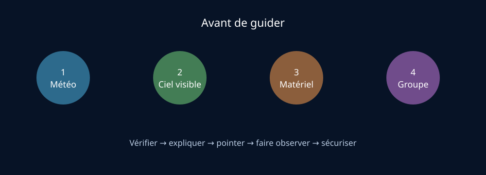

# Module 11 — Pratique de terrain : préparer et guider une observation

## Source

- **Document :** `Astronomie.pdf — Introduction à l’astronomie`
- **Pages :** 30–41 du PDF
- **Source Drive :** [Astronomie.pdf](https://drive.google.com/file/d/1VKdzcqjsHL7iiYPSFOkPYnqRRlyCM-Fq/view?usp=drivesdk)

## Support visuel

*Figure 1 — Séquence de préparation d’une observation guidée. Schéma original créé pour ce support.*

## Objectif

Préparer une observation réaliste, sûre et accessible, puis guider un groupe dans le repérage des objets célestes.

## Conditions à vérifier

- obscurité suffisante et phase de Lune adaptée ;
- ciel dégagé ou stratégie en cas de nuages ;
- éphémérides et objets réellement visibles ;
- matériel fonctionnel ;
- vêtements adaptés ;
- organisation et sécurité du groupe ;
- horizon et hauteur de lever ou de coucher des objets.

L’Observatoire Centre Ardenne est présenté dans le syllabus comme une ressource permanente pour l’observation astronomique en Belgique. Voir aussi [l’Annexe I](../inventaire-sources.md).

## Organisation d’un groupe

Le syllabus donne un ordre de grandeur d’environ une minute par personne et par objet au télescope. Avec 15 personnes et un seul instrument, le temps individuel devient très court. Il est donc pertinent de multiplier les ateliers ou de faire pointer plusieurs instruments vers des objets différents.

Une observation guidée doit alterner explications, repérage à l’œil nu, observation instrumentale et temps de circulation du groupe.

## Repérer un objet

Méthode générale :

1. identifier l’objet ou la constellation de référence ;
2. orienter le groupe vers la bonne région du ciel ;
3. utiliser la main ou un repère terrestre ;
4. utiliser une carte, un planisphère ou une application ;
5. utiliser des jumelles, une longue-vue ou un télescope ;
6. vérifier que tous les participants ont compris où regarder.

Le laser peut aider au pointage, mais il ne doit jamais être dirigé vers les yeux, un véhicule, un aéronef ou une zone de circulation aérienne. Son utilisation doit respecter les règles de sécurité locales.

## Instruments

- **Jumelles :** champ large, mobilité et simplicité ; particulièrement adaptées aux grands objets et au repérage.
- **Lunette astronomique :** système à lentilles ; l’image peut être inversée selon la configuration.
- **Télescope Newton :** miroir primaire au fond du tube, qui concentre la lumière vers le foyer.
- **Planisphère :** à régler sur la date et l’heure, puis à orienter avec les points cardinaux au-dessus de la tête.

## Étoile polaire et latitude

La Grande Ourse permet de retrouver Polaris en prolongeant la ligne formée par les deux étoiles du bord du « poêlon » environ cinq fois leur distance. Polaris indique approximativement le Nord céleste.

La hauteur de Polaris au-dessus de l’horizon est proche de la latitude du lieu. En Belgique, elle est d’environ 50°.

## Conjonction, opposition et distinction planètes-étoiles

- **Conjonction :** astres proches angulairement dans une direction donnée.
- **Opposition :** astre situé à l’opposé du Soleil dans le ciel ; la visibilité peut couvrir presque toute la nuit.
- Les planètes visibles à l’œil nu se déplacent dans la zone zodiacale.
- Les étoiles scintillent davantage ; les planètes présentent souvent un éclat plus stable.
- Mars se reconnaît souvent à sa teinte rouge-orangé, tandis que Vénus peut être très brillante mais reste proche du Soleil dans le ciel.

## Sécurité solaire

Ne jamais regarder le Soleil directement avec des jumelles ou un télescope sans filtre solaire adapté, installé correctement à l’avant de l’instrument. Le risque de lésion oculaire et de cécité est immédiat.

## Pollution lumineuse et vision nocturne

La pollution lumineuse réduit la visibilité des astres et perturbe de nombreuses espèces. Pour préserver l’adaptation nocturne :

- réduire les lumières blanches ;
- utiliser une lumière rouge faible ;
- éviter les écrans brillants ;
- laisser à l’œil le temps de s’adapter à l’obscurité.

Un laser puissant n’est pas un outil anodin : la sécurité du groupe prime sur la commodité du pointage.

## Objets du ciel profond

Le catalogue Messier rassemble 110 objets accessibles à divers instruments : étoiles doubles, amas ouverts, amas globulaires, nébuleuses et galaxies. Exemples pédagogiques : les Pléiades (M45), l’amas d’Hercule (M13), la nébuleuse d’Orion (M42), la nébuleuse de l’Anneau (M57) et Andromède (M31).

## Ressources complémentaires

- [How to Find Good Places to Stargaze — NASA](https://science.nasa.gov/solar-system/how-to-find-good-places-to-stargaze/)
- [Binoculars: A Great First Telescope — NASA](https://science.nasa.gov/solar-system/skywatching/night-sky-network/binoculars-a-great-first-telescope/)
- [Skywatching Tips — NASA](https://science.nasa.gov/skywatching/)
- [Stellarium Web](https://stellarium-web.org/)

## Checklist avant animation

- [ ] Météo et couverture nuageuse vérifiées.
- [ ] Phase et horaires de la Lune vérifiés.
- [ ] Objets visibles et hauteur suffisante vérifiés.
- [ ] Instruments, cartes et éclairages rouges disponibles.
- [ ] Règles de circulation et de sécurité expliquées.
- [ ] Aucun pointage solaire sans filtre adapté.
- [ ] Temps d’observation par participant anticipé.
- [ ] Plan B prévu en cas de nuages.
