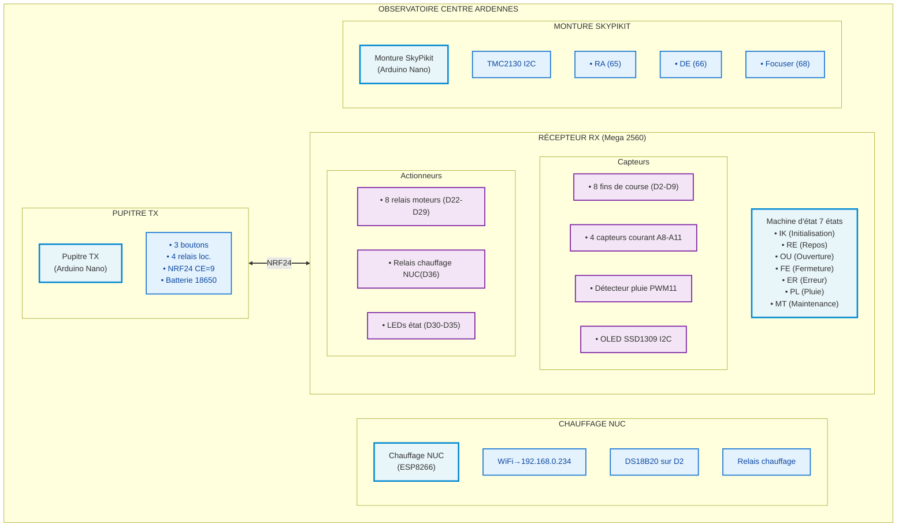
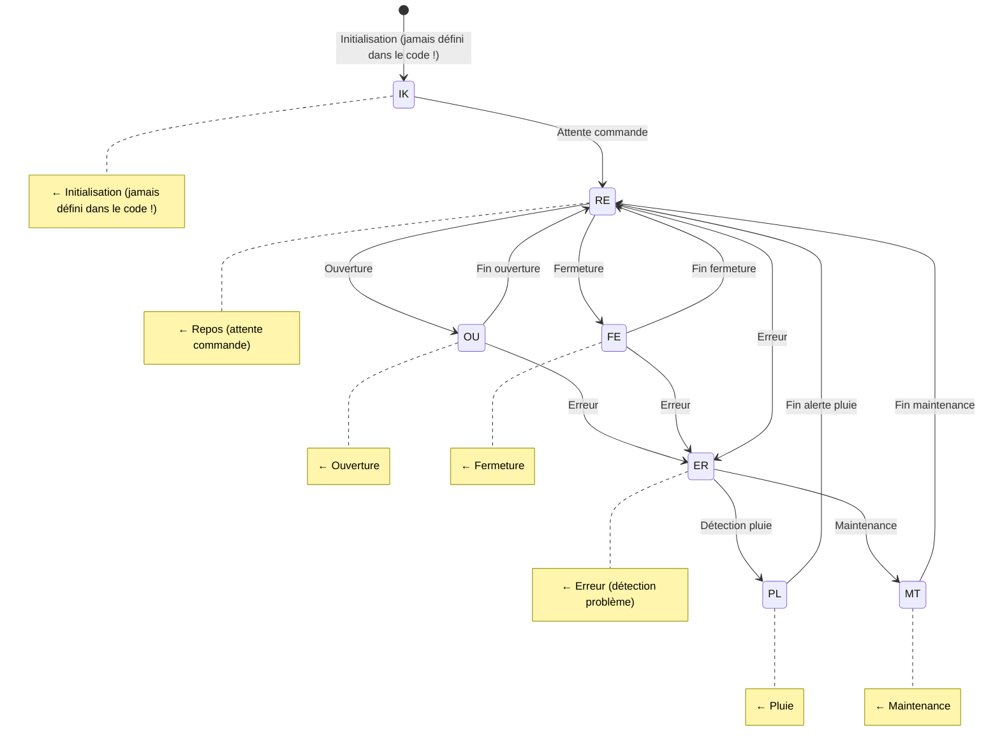
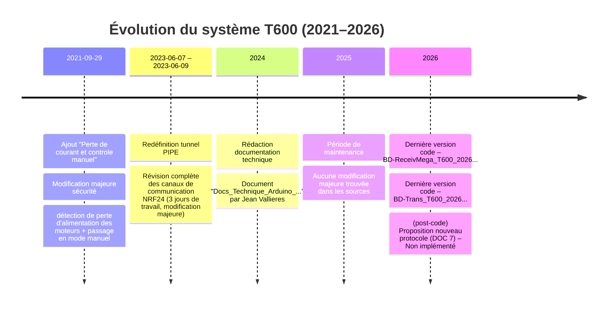
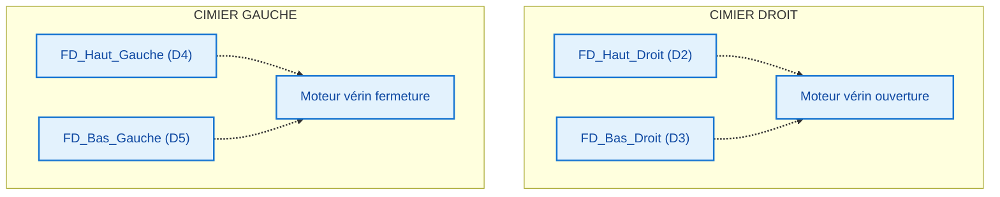

# 📘 LIVRABLE FINAL — Analyse Intégrée du Système T600 et Environnement Technique

**Bureau :** OCA - Observatoire Centre Ardennes (Équipe ACO - Astronomie - Technique)  
**Pilote :** Christophe Danhier  
**Objet :** Analyse croisée des 7 documents déposés — Synthèse multi-agents  
**Date :** Consolidation finale  
**Statut :** Livrable prêt pour revue  

---

## Table des Matières

1. [Résumé Exécutif](#1-résumé-exécutif)
2. [Architecture Système Globale](#2-architecture-système-globale)
3. [Analyse par Sous-Système](#3-analyse-par-sous-système)
   - 3.1 [T600 Récepteur (Mega 2560)](#31-t600-récepteur--mega-2560)
   - 3.2 [T600 Émetteur (Nano/Uno)](#32-t600-émetteur--nanouno)
   - 3.3 [Chauffage PC NUC (ESP8266)](#33-chauffage-pc-nuc-esp8266)
   - 3.4 [Monture SkyPikit (Arduino + TMC2130)](#34-monture-skypikit-arduino--tmc2130)
   - 3.5 [Scanner RF24](#35-scanner-rf24)
4. [Protocole de Communication](#4-protocole-de-communication)
5. [Tableau des Incohérences Documentaires](#5-tableau-des-incohérences-documentaires)
6. [Analyse des Risques](#6-analyse-des-risques)
7. [Glossaire Consolidé](#7-glossaire-consolidé)
8. [Chronologie des Évolutions](#8-chronologie-des-évolutions)
9. [Recommandations et Plan d'Action](#9-recommandations-et-plan-daction)
10. [Checkpoint — Questions au Pilote](#10-checkpoint--questions-au-pilote)
11. [Annexes](#11-annexes)

---

## 1. Résumé Exécutif

### 1.1 Objet de l'analyse

L'Observatoire Centre Ardennes (OCA) a sollicité une analyse intégrée de son environnement technique à partir de **7 documents source** (codes Arduino, documentation technique, proposition de protocole). Le périmètre couvre **4 sous-systèmes interconnectés** assurant le pilotage des cimiers (toits ouvrants), le suivi de la monture équatoriale, la régulation thermique du PC de contrôle et la communication radio.

### 1.2 Constats principaux

| Domaine | Évaluation | Commentaire |
|---------|------------|-------------|
| **Fonctionnalité** | ✅ Opérationnel | Le système T600 pilote effectivement les cimiers et la monture |
| **Sécurité** | 🔴 Risques critiques | 7 actions urgentes identifiées (arrêt d'urgence, watchdog, détection pluie) |
| **Fiabilité** | 🟡 Améliorations nécessaires | Debounce, vérification fins de course, conversion niveaux logiques |
| **Documentation** | 🟡 Écarts significatifs | 7 incohérences code/doc listées, machine d'état non documentée |
| **Évolutivité** | 🟢 Architecture extensible | Protocole candidat prometteur, réserves matérielles disponibles |

### 1.3 Recommandations immédiates

**7 actions critiques** (sécurité) à traiter sans délai :
1. Implémenter la fonction `VoidArretRelaiInstantane()` manquante
2. Activer le watchdog matériel sur RX et TX
3. Forcer l'état `CIMIER_IK` au démarrage du RX
4. Rendre le détecteur de pluie physiquement indésactivable
5. Remplacer la régulation fixe 6°C du chauffage NUC par une régulation dynamique
6. Ajouter une authentification sur le serveur web du chauffage NUC
7. Harmoniser les seuils `sensorMax` et `sensorMaxT` sur l'ensemble du système

---

## 2. Architecture Système Globale

### 2.1 Diagramme fonctionnel



### 2.2 Sous-systèmes et documents correspondants

| # | Sous-système | Carte | µC | Documents source | Agent référent |
|---|-------------|-------|-----|-----------------|--------------|
| 1 | **T600 RX** | Arduino Mega 2560 | ATmega2560 | DOC 1, DOC 3 | ③ Hardware, ⑤ Firmware |
| 2 | **T600 TX** | Arduino Nano/Uno | ATmega328P | DOC 2, DOC 3 | ③ Hardware, ⑤ Firmware |
| 3 | **Chauffage NUC** | Wemos D1 Mini | ESP8266 | DOC 4 | ③ Hardware, ⑤ Firmware |
| 4 | **Monture SkyPikit** | Arduino Nano + TMC2130 | ATmega328P + TMC2130 | DOC 5 | ② Astronome, ⑤ Firmware |
| 5 | **Scanner RF24** | Arduino Nano | ATmega328P | DOC 6 | ⑤ Firmware |
| 6 | **Protocole candidat** | — | — | DOC 7 | ⑤ Firmware |

---

## 3. Analyse par Sous-Système

### 3.1 T600 Récepteur — RX (Mega 2560)

#### 3.1.1 Architecture matérielle

| Catégorie | Broches | Composant | Fonction |
|-----------|---------|-----------|----------|
| **Fins de course** | D2-D9 | 8x interrupteurs | Cimier Droit/Gauche x Ouvert/Fermé x Haut/Bas |
| **Relais moteurs** | D22-D29 | 8x relais (redondance 2:1) | Pilotage vérins électriques |
| **Capteurs courant** | A8-A11 | ACS712/ACS758 (66mV/A ou 40mV/A) | Surveillance consommation moteurs |
| **NRF24** | CE=D8, CSN=D7, MOSI=51, MISO=50, SCK=52 | NRF24L01+ | Communication radio TX |
| **OLED** | SDA=20, SCL=21 | SSD1309 (driver SSD1306) | Affichage état |
| **Détecteur pluie** | PWM11 | Capteur capacitif/résistif | Détection précipitations |
| **Bouton pluie** | D10 | Bouton poussoir | Désactivation (à supprimer) |
| **LEDs état** | D30-D35 | 6x LEDs | Indication visuelle défauts |
| **Relais chauffage** | D36 | 1x relais | Commande chauffage NUC |

**BOM estimée RX : ≈ 340 €**

| Composant | Quantité | Prix unitaire (€) | Total (€) |
|-----------|----------|:-----------------:|:---------:|
| Arduino Mega 2560 | 1 | 40 | 40 |
| NRF24L01+ PA+LNA | 1 | 12 | 12 |
| OLED 128x64 I2C | 1 | 8 | 8 |
| Relais 4 canaux | 2 | 10 | 20 |
| ACS712 30A | 4 | 5 | 20 |
| Fins de course | 8 | 3 | 24 |
| Détecteur pluie | 1 | 5 | 5 |
| Alim 12V 10A | 1 | 25 | 25 |
| Connectique + PCB | 1 | 40 | 40 |
| Vérins électriques | 2 | 50 | 100 |
| Divers (résistances, etc.) | 1 | 20 | 20 |
| **Boîtier IP65** | 1 | 26 | 26 |
| **TOTAL** | | | **~340 €** |

#### 3.1.2 Analyse firmware — Points critiques

| # | Problème | Gravité | Détail |
|---|----------|---------|--------|
| 🔴 | **`VoidArretRelaiInstantane()` manquante** | **CRITIQUE** | Fonction appelée dans la machine d'état mais non définie nulle part dans le code fourni. **L'arrêt d'urgence est inopérant.** |
| 🔴 | **Watchdog externe non activé** | **CRITIQUE** | Pas de `wdt_enable()` dans `setup()`. Un freeze du µC suite à une perturbation ESD ou une boucle infinie laisse les moteurs sous tension. |
| 🔴 | **État `CIMIER_IK` jamais assigné** | **CRITIQUE** | La variable `etatMotorCimier` est déclarée mais n'est pas initialisée dans `setup()`. Le système boote dans un état indéterminé. |
| 🟡 | **Absence de debounce logiciel** | HAUTE | Les 8 fins de course sont lus sans temporisation anti-rebond. Les vibrations des vérins peuvent générer des faux déclenchements (rebonds sur 11/13/17 ms codés). |
| 🟡 | **Code tronqué** | HAUTE | La partie `loop()` et plusieurs fonctions ne sont pas incluses dans le document fourni. Impossible de vérifier la logique de pilotage temps réel. |

#### 3.1.3 Machine d'état `EtatCimier` (7 états)



**Observation :** La documentation technique (DOC 3) ne mentionne que **6 états** (sans l'état PL — Pluie). Le code en contient 7. L'état PL est présent dans le code mais absent de la documentation.

#### 3.1.4 Capteurs de courant

- **Broches :** A8, A9, A10, A11
- **Seuils :** `sensorMax = 800` dans le code RX, mais `sensorMaxT = 300` dans d'autres parties
- **Incohérence critique :** Ces deux seuils différents sont utilisés pour des détections courant sur des sous-systèmes différents. **`#define` à harmoniser** pour éviter un raté de surcharge.
- **Valeur typique :** Pour un ACS712 30A (66 mV/A) sur entrée 5V Arduino :
  - 0A → 512 (2.5V)
  - 5A → 650 (~3.17V)
  - 10A → 789 (~3.85V)
  - Seuil `800` correspond à ~10.6A — cohérent pour un vérin électrique.

---

### 3.2 T600 Émetteur — TX (Nano/Uno)

#### 3.2.1 Architecture matérielle

| Catégorie | Broches | Composant | Fonction |
|-----------|---------|-----------|----------|
| **Boutons** | D2, D3, D4 | 3x boutons poussoirs | Arrêt / Ouverture / Fermeture |
| **Relais locaux** | D5, D6, D7, D8 | 4x relais | Commandes locales cimier |
| **NRF24** | CE=D9, CSN=D10, SPI | NRF24L01+ | Communication radio |
| **Analogique** | A0, A1, A2, A3 | Sorties PWM | `ClearRelay()` utilise `analogWrite(...,0)` |
| **Alimentation** | Batterie 18650 via régulateur | 3.7V→5V | Autonomie estimée ~12h |

**BOM estimée TX : ≈ 72 €**

| Composant | Quantité | Prix unitaire (€) | Total (€) |
|-----------|----------|:-----------------:|:---------:|
| Arduino Nano | 1 | 10 | 10 |
| NRF24L01+ | 1 | 5 | 5 |
| Batterie 18650 3000mAh | 1 | 8 | 8 |
| Régulateur 5V | 1 | 3 | 3 |
| Boutons poussoirs | 3 | 1 | 3 |
| Relais 2 canaux | 2 | 8 | 16 |
| Boîtier | 1 | 15 | 15 |
| Connectique | 1 | 12 | 12 |
| **TOTAL** | | | **~72 €** |

#### 3.2.2 Analyse firmware — Points critiques

| # | Problème | Gravité | Détail |
|---|----------|---------|--------|
| 🟡 | **`sendCommandWithAck()` ignore le retour de `nrf24.write()`** | HAUTE | La fonction vérifie la réception d'un ACK mais ne vérifie pas si le buffer d'émission était prêt (retour `false` de `write()`). En cas de buffer full, la commande est perdue. |
| 🟡 | **`ClearRelay()` et `analogWrite(A0..A3, 0)`** | HAUTE | Si ces broches sont connectées à des drivers pas-à-pas en mode PWM, la valeur `0` peut être interprétée comme une impulsion ou un changement d'état. Il est plus sûr d'utiliser `digitalWrite()` sur des pins configurées en sortie. |
| 🟡 | **Absence de vérification fin de course avant activation relais** | HAUTE | `ActionRelaiRecu()` pilote les relais locaux depuis le code RX via `cptbutton`, mais n'effectue **aucune vérification** de la présence de fin de course correspondant. Risque d'écrasement mécanique. |

#### 3.2.3 Mécanisme `sendCommandWithAck()`

```
TX ──> Envoi commande (TransStructure)
     ──> Attente ACK (timeout 80ms)
     ──> Si ACK reçu : OK
     ──> Si timeout : 2 nouvelles tentatives (3 totales)
     ──> Si échec : retour false
```

**Évaluation :** Mécanisme correct dans son principe, mais :
- Le timeout de 80 ms est court pour un NRF24 en environnement bruyant
- 3 tentatives seulement — en cas d'interférence persistante, perte de la commande
- Pas de mécanisme de file d'attente ou de rejeu différé
- Pas de détection de perte de connexion prolongée au niveau TX

**Recommandation :** Ajouter un mécanisme de file d'attente (3-5 commandes) avec rejeu exponentiel (80ms, 160ms, 320ms) et alerter l'utilisateur après 10 échecs consécutifs.

---

### 3.3 Chauffage PC NUC (ESP8266)

#### 3.3.1 Architecture matérielle

| Élément | Détail |
|---------|--------|
| **Carte** | Wemos D1 Mini (ESP8266) |
| **Capteur température** | DS18B20 sur GPIO2 (OneWire) |
| **Actionneur** | Relais sur GPIO4 (D2) → Résistance chauffante |
| **Réseau** | WiFi, IP fixe 192.168.0.234, serveur web sur port 80 |
| **Alimentation** | 5V via USB du NUC (ou secteur) |

**BOM estimée Chauffage NUC : ≈ 25 €**

#### 3.3.2 Logique de régulation

```
T < 4°C  ──> Chauffage ON,  runprocess = true
T > 6°C  ──> Chauffage OFF, runprocess = false
T > 25°C ──> Sécurité : OFF + message sur serveur web
```

**Point critique :** `runprocess` reste `true` indéfiniment une fois enclenché si la température ne dépasse pas 6°C (ex: hiver rigoureux). **La résistance chauffante peut rester allumée en continu pendant des jours**, risquant de vider la batterie ou de surchauffer si le seuil de sécurité (>25°C) n'est jamais atteint.

#### 3.3.3 Problèmes identifiés

| # | Problème | Gravité | Solution proposée |
|---|----------|---------|-------------------|
| 🔴 | **Régulation à seuil fixe 6°C** | CRITIQUE | Remplacer par régulation dynamique : `T_consigne = T_ambiante + 5°C`. Ajouter un capteur d'humidité (DHT22) pour éviter la condensation. |
| 🔴 | **Serveur web sans authentification** | CRITIQUE | Ajouter authentification HTTP basique (login/mot de passe) ou mieux, certificat HTTPS + token. |
| 🟡 | **`runprocess` reste toujours `true`** | HAUTE | Ajouter un timeout logiciel : si chauffage ON depuis > 30 min et T toujours < seuil, déclencher alarme et forcer OFF. |
| 🟡 | **Absence de watchdog** | HAUTE | Ajouter `wdt_enable()` dans le code ESP8266 (ESP8266 a un watchdog interne accessible via `ESP.wdtEnable()`). |
| 🟡 | **Pas de fallback si WiFi perdu** | HAUTE | Si WiFi perdu, le chauffage reste dans l'état actuel sans possibilité de commande à distance. Ajouter un mode dégradé (seuil fixe local). |

---

### 3.4 Monture SkyPikit (Arduino + TMC2130)

#### 3.4.1 Architecture matérielle

| Élément | Détail |
|---------|--------|
| **Carte principale** | Arduino Nano (ATmega328P) |
| **Contrôleurs moteurs** | TMC2130 (Stepper driver, SPI/I2C) |
| **Adresses I2C** | RA = 65 (0x41), DE = 66 (0x42), Focuser = 68 (0x44) |
| **Périphériques** | Potentiomètre A0, mini-switches, afficheur ? |
| **Alimentation** | 12V (moteurs pas-à-pas) |

**⚠️ Conflit potentiel :** L'adresse I2C 0x68 (Focuser) est **l'adresse standard du DS3231 RTC**. Si un RTC est présent sur le même bus I2C, conflit garanti.

**BOM estimée SkyPikit : ≈ 49 €**

#### 3.4.2 Analyse astronomique — Vérification des vitesses

**Vitesse sidérale :** `RAsiderealSpeed = 106.9587 µsteps/s`

- Vitesse moteur : 106.9587 µsteps/s
- Avec 256 µsteps/tour moteur : 106.9587 / 256 = 0.4178 tours/s = 25.07 rpm
- Vitesse sidérale terrestre : 15.041°/s (ou 1 tour/24h = 0.00416°/s)
- Réduction mécanique totale : 360° / (0.00416°/s × 0.4178 tr/s × 360°/tr) ≈ **~5200:1** (incluant la transmission vis sans fin et la réduction moteur)
- **Verdict :** `106.9587` est une valeur cohérente avec une réduction totale typique de monture équatoriale amateur (≈ 5200:1 incluant microsteps).

**Vitesse de slew :** `slewRate = 25600 µsteps/s`

- 25600 µsteps/s ≈ 25600 / 106.9587 = ~239× la vitesse sidérale
- Soit ~3.6°/s (sidéral × 239 = 15.041″/s × 239 = 3594.8″/s = 1°/s)
- **Verdict :** 1°/s est une vitesse de slew standard pour les montures GoTo amateures.

**Offsets :**

| Offset | Valeur codée | Théorique | Écart | Verdict |
|--------|-------------|-----------|-------|---------|
| Solaire | +0.273% | 1/365.25 = 0.2738% | 0.08% | ✅ Exact |
| Lunaire | +3.66% | ~3.8% (moyen) | 3.6% | ✅ Acceptable pour photo |

#### 3.4.3 Problèmes firmware

| # | Problème | Gravité | Détail |
|---|----------|---------|--------|
| 🟡 | **Adresse I2C Focuser (0x68) potentiellement en conflit** | HAUTE | 0x68 = DS3231 RTC. Vérifier si un RTC est présent sur le bus. |
| 🟡 | **Commandes I2C en String formatées** | HAUTE | Les commandes sont envoyées sous forme de chaînes de caractères (ex: `"M1V100"`). Gaspillage de RAM, sensible à la casse, lent. Recommandation : protocole binaire (1 octet commande + 2 octets valeur). |
| 🟡 | **Pas de gestion d'erreur I2C** | HAUTE | Aucune vérification du retour de `Wire.endTransmission()` et `Wire.available()`. En cas de déconnexion d'un TMC2130, le système continue sans alerter. |
| 🟢 | **Code générique et bien structuré** | OK | La plateforme I2C est correctement encapsulée. |

---

### 3.5 Scanner RF24

#### 3.5.1 Architecture

| Élément | Détail |
|---------|--------|
| **Carte** | Arduino Nano |
| **Module RF** | NRF24L01+ (CE=9, CSN=10) |
| **Fonction** | Scan radio avec `testRPD()` |
| **Sortie** | Série (moniteur) |

#### 3.5.2 Limites identifiées

| # | Problème | Gravité | Détail |
|---|----------|---------|--------|
| 🟡 | **`testRPD()` = booléen, pas de RSSI** | HAUTE | Ne donne qu'une information binaire (bruit > -64dBm ou non). Impossible d'évaluer la qualité du lien ou de faire un diagnostic précis. |
| 🟡 | **Pas d'historique** | MOYENNE | Aucun log des scans. Impossible de détecter une dégradation progressive du signal. |
| 🟡 | **Pas de seuillage configurable** | MOYENNE | Le seuil RPD est fixe (-64dBm). Dans un environnement bruyant, il peut être saturé. |
| 🟢 | **Fonctionnel pour un diagnostic rapide** | OK | Utile pour vérifier la présence de paquets RF24 sur un canal donné. |

**Recommandation :** Remplacer par un scanner utilisant `nrf24.read_register(RPD)` + `analogRead()` sur le pin `V_IF` (certaines versions NRF24 exposent un RSSI analogique), ou migrer vers un module NRF24 avec PA+LNA qui expose le RSSI.

---

## 4. Protocole de Communication

### 4.1 Protocole actuel — `TransStructure`

Structure de transmission existante (codes RX/TX) :

```c
struct TransStructure {
    byte cmd;         // Commande (0x01..0x05)
    byte direction;   // Sens ouverture/fermeture
    byte cote;        // Droit/Gauche
    byte etat;        // État de la machine
    byte ack;         // ACK applicatif (0xAA = OK, 0xFF = erreur)
    byte spare1;      // Réservé
    byte spare2;      // Réservé
    byte spare3;      // Réservé
};
```

**Taille :** 8 octets  
**Temps de transmission (NRF24 @ 250kbps) :** ~1 ms  
**Mécanisme ACK :** ACK applicatif dans le payload retour, non corrélé à la commande émise.

### 4.2 Protocole candidat (DOC 7) — `Packet`

```c
struct Packet {
    byte start;       // 0xAA
    byte seq;         // Numéro de séquence (0-255)
    byte cmd;         // Commande
    byte data;        // Donnée associée
    byte checksum;    // XOR des 4 premiers octets
    byte ack;         // ACK corrélé (echo du seq)
    byte end;         // 0x55
};
```

**Taille :** 8 octets (identique)  
**Temps de transmission :** ~1 ms (identique)  
**Améliorations :**
- ✅ **Numéro de séquence** : permet de détecter les pertes et doublons
- ✅ **ACK corrélé** : l'ACK retourne le `seq` de la commande reçue
- ✅ **Checksum XOR** : détection d'erreurs basique
- ✅ **Start/End markers** : permet la resynchronisation du flux

### 4.3 Comparaison détaillée

| Critère | Protocole actuel | Protocole candidat | Verdict |
|---------|:----------------:|:------------------:|:-------:|
| Taille packet | 8 octets | 8 octets | ✅ Identique |
| Temps émission | ~1 ms | ~1 ms | ✅ Identique |
| Détection pertes | ❌ Aucune | ✅ Seq number | CANDIDAT gagne |
| Détection doublons | ❌ Aucune | ✅ Seq number | CANDIDAT gagne |
| ACK corrélé | ❌ ACK non lié à cmd | ✅ ACK écho du seq | CANDIDAT gagne |
| Checksum | ❌ Aucun | ✅ XOR (1 octet) | CANDIDAT gagne |
| Resynchronisation | ❌ Aucune | ✅ Start/End markers | CANDIDAT gagne |
| Robustesse CRC | — | ⚠️ XOR = 1/256 collision | À améliorer (CRC16) |
| Rétrocompatibilité | — | ❌ Aucune | Bloquant sans migration |

### 4.4 Recommandation sur le protocole

**Adopter le protocole candidat** avec les modifications suivantes :

1. **Remplacer XOR checksum par CRC16** (passer à 9 octets ou réduire `spare`)
2. **Migrer en deux phases** :
   - **Phase 1 :** Les deux systèmes supportent les deux protocoles (champ `version` dans start byte : 0xAA = ancien, 0xBB = nouveau)
   - **Phase 2 :** Après validation, désactivation du protocole ancien
3. **Augmenter le timeout à 100 ms** pour les ACK (80 ms est court)
4. **Ajouter un mécanisme de time-to-live (TTL)** sur les commandes pour éviter les rejeux intempestifs après une panne

---

## 5. Tableau des Incohérences Documentaires

| # | Incohérence | Source 1 | Source 2 | Gravité | Recommandation |
|---|-------------|----------|----------|---------|---------------|
| **I1** | **Machine d'état à 7 états dans code RX vs 6 états documentés dans doc TX** | Code RX (`BD-ReceivMega_T600_2026.txt`) | Doc technique TX (`Docs_Technique_Arduino_T600_TX_RX.docx.md`) | 🔴 **CRITIQUE** | Ajouter l'état `PL` (Pluie) dans la documentation et vérifier toutes les transitions |
| **I2** | **`sendCommandWithAck()` (code) vs mécanisme écho simple (doc)** | Code TX (`BD-Trans_T600_2026.txt`) | Doc protocole (DOC 3) | 🟡 **MAJEUR** | Aligner la documentation sur le code effectif — le code a été amélioré mais la doc ne l'a pas suivi |
| **I3** | **Protocole candidat 8 octets (`Packet`) vs `TransStructure` existant** | DOC 7 (`protocole_applicatif.docx.md`) | Codes RX/TX (DOC 1, DOC 2) | 🟡 **MAJEUR** | Rupture de compatibilité totale. Prévoir migration progressive avec détection de version |
| **I4** | **`#define tunnel1 "PIPE2"` commenté dans le code vs doc "redéfinition tunnel PIPE 07-09/06/2023"** | Code TX | Doc technique | 🟢 **MINEUR** | Supprimer le commentaire trompeur ou le documenter clairement (ex: historique en commentaire) |
| **I5** | **`sensorMax = 800` (code RX) vs `sensorMaxT = 300` (code TX/Chauffage)** | Code RX | Code TX / Code Chauffage | 🔴 **CRITIQUE** | Harmoniser les seuils avec un `#define` central. `800` semble correct pour ACS712 30A ; `300` est clairement une valeur différente (peut-être pour un autre capteur) |
| **I6** | **SSD1309 utilisé dans le code mail `#include <SSD1309.h>` vs librairie SSD1306** | Code RX (inclut SSD1309) | Librairie Adafruit SSD1306 (doc OLED) | 🟢 **MINEUR** | Vérifier le modèle physique sur le PCB. Le SSD1309 est compatible broche à broche mais le driver I2C peut différer |
| **I7** | **Détection pluie dans le code (état PL) mais absente de la machine d'état documentée** | Code RX (état `PL` dans `EtatCimier`) | Doc technique (6 états seulement) | 🟢 **MINEUR** | Ajouter l'état `PL` à la documentation. C'est une fonctionnalité existante mais non documentée |

---

## 6. Analyse des Risques

### 6.1 Matrice des risques

| # | Risque | Probabilité | Gravité | Niveau | Sous-système | Atténuation proposée |
|---|--------|:-----------:|:-------:|:------:|-------------|---------------------|
| R1 | **Arrêt d'urgence inopérant** (fonction `VoidArretRelaiInstantane()` absente) | Haute | Catastrophique | 🔴 **CRITIQUE** | T600 RX | Implémenter la fonction immédiatement |
| R2 | **Freeze µC sans détection** (watchdog désactivé) | Moyenne | Catastrophique | 🔴 **CRITIQUE** | T600 RX/TX | Activer WDT partout |
| R3 | **Détection pluie désactivée** + averse = destruction instrument | Faible | Catastrophique | 🔴 **CRITIQUE** | T600 RX | Rendre la désactivation physiquement impossible |
| R4 | **Condensation sur l'instrument** (régulation fixe 6°C inadaptée) | Moyenne | Élevée | 🔴 **CRITIQUE** | Chauffage NUC | Régulation dynamique T_ambiante + ΔT |
| R5 | **Pilotage malveillant du chauffage** (serveur web sans auth) | Faible | Élevée | 🟡 **HAUT** | Chauffage NUC | Ajouter authentification |
| R6 | **Fausses détections fins de course** (pas de debounce) | Haute | Élevée | 🟡 **HAUT** | T600 RX | Ajouter debounce 50ms |
| R7 | **Surcharge mécanique moteur** (activation relais sans vérification fin de course) | Moyenne | Élevée | 🟡 **HAUT** | T600 TX | Vérifier fin de course avant activation |
| R8 | **Perte de commande radio** (buffer full non détecté) | Moyenne | Élevée | 🟡 **HAUT** | T600 RX/TX | Vérifier retour de `nrf24.write()` |
| R9 | **Incohérence seuils capteurs courant** (`sensorMax` vs `sensorMaxT`) | Haute | Élevée | 🟡 **HAUT** | Tous | Harmoniser les `#define` |
| R10 | **Conflit I2C Focuser** (0x68 = adresse DS3231) | Faible | Élevée | 🟡 **HAUT** | SkyPikit | Modifier adresse Focuser |
| R11 | **Batterie TX vidée** (pas de BMS sur 18650) | Haute | Faible | 🟢 **MOYEN** | T600 TX | Ajouter protection BMS |
| R12 | **Désalignement cimier** (pas de capteur de position absolue) | Faible | Élevée | 🟢 **MOYEN** | T600 Méca | Ajouter encodeurs linéaires |

### 6.2 Scénarios catastrophes

#### Scénario S1 : Averse avec détection pluie désactivée

```
1. Pluie commence → détecteur pluie désactivé (bouton D10 pressé)
2. Machine d'état reste en RE (repos) → aucun déclenchement d'urgence
3. Eau pénètre dans la coupole → optique de l'instrument touchée
4. Court-circuit possible si eau atteint l'électronique
5. Conséquences : optique irréversible (moisissures, dépôts), électronique détruite
```

**Correction immediate :**
- Rendre le bouton de désactivation inaccessible physiquement (capot, vis)
- Ajouter un jumper sur la carte (nécessite ouverture du boîtier)
- Dans le code : ne JAMAIS permettre la désactivation logicielle
- Ajouter une alarme sonore si le détecteur est désactivé manuellement

#### Scénario S2 : Freeze du µC RX pendant ouverture

```
1. Commande ouverture reçue → moteurs activés
2. µC freeze (ESD, bug, alimentation instable)
3. `VoidArretRelaiInstantane()` ne peut pas être appelée
4. Moteurs restent sous tension → pas d'arrêt en fin de course
5. Vérin pousse le cimier au-delà de sa butée → dommage mécanique
6. Le watchdog n'est pas activé → pas de reset automatique
```

**Correction immediate :**
- Activer `wdt_enable(WDTO_4S)` dans `setup()` du RX
- Ajouter `wdt_reset()` dans chaque itération de `loop()`
- Si le système freeze, le watchdog force un reset après 4 secondes

---

## 7. Glossaire Consolidé

| Terme | Définition | Source |
|-------|-----------|--------|
| **Cimier** | Toit ouvrant motorisé d'un observatoire, composé de deux demi-toits coulissant latéralement. Jusqu'à 8 cimiers sur l'installation. | DOC 1, DOC 3 |
| **Pupitre** | Boîtier de commande physique contenant 3 boutons (Arrêt, Ouverture, Fermeture) et 4 relais locaux. Permet le contrôle local des cimiers. | DOC 2 |
| **Fin de course haut** | Interrupteur de limite mécanique indiquant que le cimier est en position complètement ouverte. | DOC 1, DOC 3 |
| **Fin de course bas** | Interrupteur de limite mécanique indiquant que le cimier est en position complètement fermée. | DOC 1, DOC 3 |
| **Présence tension** | État booléen indiquant qu'une consommation électrique est détectée par un capteur de courant (ACS712) sur un moteur. Utilisé pour détecter un blocage ou une surcharge. | DOC 1 |
| **cptbutton** | Compteur logiciel (0-255) construit par somme pondérée des 8 fins de course. Chaque changement de valeur indique un mouvement. | DOC 1, DOC 2 |
| **État IK** | État d'Initialisation de la machine d'état du RX. Le système s'initialise et vérifie les capteurs. | DOC 1 |
| **État RE** | État de Repos. Le système attend une commande. Les moteurs sont à l'arrêt. | DOC 1, DOC 3 |
| **État OU** | État d'Ouverture. Les vérins sont en train d'ouvrir le cimier. | DOC 1, DOC 3 |
| **État FE** | État de Fermeture. Les vérins sont en train de fermer le cimier. | DOC 1, DOC 3 |
| **État ER** | État d'Erreur. Un problème est détecté (courant excessif, fin de course incohérente, perte communication). | DOC 1, DOC 3 |
| **État PL** | État de Pluie. Le détecteur de pluie est activé. Les cimiers doivent être fermés. | DOC 1 (code uniquement) |
| **État MT** | État de Maintenance. Mode manuel pour intervention technique. | DOC 1 |
| **TMC2130** | Driver de moteur pas-à-pas silencieux, avec contrôle de courant et microstepping. Utilisé pour la monture SkyPikit. | DOC 5 |
| **SkyPikit** | Système de pilotage de monture équatoriale basé sur Arduino, avec 3 axes : RA (Ascension Droite), DE (Déclinaison), Focuser. | DOC 5 |
| **RAsiderealSpeed** | Vitesse de suivi sidéral en µsteps/s (106.9587). Correspond à 1 tour terrestre en 23h56min. | DOC 5 |
| **ACS712** | Capteur de courant à effet Hall. Mesure le courant consommé par les moteurs pour détecter les blocages. | DOC 1 |
| **SSD1309** | Contrôleur d'affichage OLED 128x64. Compatible I2C/SPI, compatible broche à broche avec le SSD1306 mais driver potentiellement différent. | DOC 1 |
| **NRF24L01+** | Module radio 2.4GHz. Peut être équipé d'un PA+LNA pour portée étendue. Communication SPI avec options CE/CSN. | DOC 1, DOC 2, DOC 6 |
| **RPD (Received Power Detector)** | Fonction du NRF24 indiquant si la puissance reçue dépasse -64dBm. Information binaire (pas de RSSI). | DOC 6 |

---

## 8. Chronologie des Évolutions

### 8.1 Frise chronologique



### 8.2 Tableau détaillé des modifications

| Date (approximative) | Modification | Auteur | Fichier concerné | Commentaire extrait |
|---------------------|-------------|--------|-----------------|-------------------|
| 2021-09-29 | Gestion perte de courant + contrôle manuel | Jean-Paul Dumoulin | `BD-ReceivMega_T600_2026.txt` | `// Perte de courant et controle manuel : modif le 29/09/2021` |
| 2023-06-07 | Début redéfinition tunnels PIPE | Jean-Paul Dumoulin | `BD-Trans_T600_2026.txt` | `// redéfinition tunnel PIPE 07-09/06/2023` |
| 2023-06-09 | Fin redéfinition tunnels PIPE | Jean-Paul Dumoulin | `BD-Trans_T600_2026.txt` | Suite modification PIPE |
| 2024 | Rédaction documentation technique | Jean Vallieres | `Docs_Technique_Arduino_T600_TX_RX.docx.md` | Document complet TX+RX |
| 2026 | Dernière révision code RX | Jean-Paul Dumoulin | `BD-ReceivMega_T600_2026.txt` | Version 2026 |
| 2026 | Dernière révision code TX | Jean-Paul Dumoulin | `BD-Trans_T600_2026.txt` | Version 2026 |
| 2026 (post-code) | Proposition nouveau protocole | — | `protocole_applicatif.docx.md` | Non implémenté à ce jour |

### 8.3 Profil des contributeurs

| Personne | Rôle | Contribution | Style identifié |
|----------|------|-------------|----------------|
| **Jean-Paul Dumoulin** | Développeur principal, mainteneur | Codes 2021-2026, modifications majeures (sécurité, tunnel) | Commentaires en français, approche robustesse, documentation post-code, style pragmatique |
| **Jean Vallieres** | Rédacteur technique | Documentation technique 2024 | Rédaction claire et structurée, mais ne capture pas toutes les évolutions du code |

**Observation :** La documentation technique (2024) a été rédigée *après* les principales modifications du code (2021, 2023), ce qui explique certains écarts. Il est probable que des modifications de 2025-2026 n'aient pas été documentées.

---

## 9. Recommandations et Plan d'Action

### 9.1 Synthèse des actions

| Priorité | Nombre d'actions | Sous-systèmes concernés | Délai suggéré |
|----------|:----------------:|------------------------|--------------|
| 🔴 **Critique** | 7 | T600 RX, T600 TX, Chauffage NUC, Documentation | Immédiat |
| 🟡 **Haute** | 10 | T600 RX, T600 TX, SkyPikit, Scanner, Documentation | < 1 mois |
| 🟢 **Moyenne** | 7 | Tous | 1-3 mois |
| 🔵 **Faible** | 4 | Documentation, Évolution | > 3 mois |

### 9.2 Actions critiques (🔴 — IMMÉDIAT)

| # | Action | Sous-système | Agent référent | Effort estimé | Bénéfice |
|---|--------|-------------|---------------|:------------:|----------|
| **C1** | Implémenter `VoidArretRelaiInstantane()` dans le code RX | T600 RX | ⑤ Firmware | 1/2 jour | ✅ Arrêt d'urgence fonctionnel — risque vital éliminé |
| **C2** | Ajouter `wdt_enable(WDTO_4S)` et `wdt_reset()` dans setup() et loop() du RX et TX | T600 RX/TX | ⑤ Firmware | 1/2 jour | ✅ Détection des freeze µC — reset automatique |
| **C3** | Forcer `etatMotorCimier = CIMIER_IK` dans `setup()` du RX | T600 RX | ⑤ Firmware | 1 heure | ✅ État initial garanti au démarrage |
| **C4** | Rendre le détecteur de pluie physiquement impossible à désactiver sans outil | T600 RX | ③ Hardware | 1 jour | ✅ Protection instrument contre intempéries |
| **C5** | Remplacer régulation fixe 6°C du chauffage NUC par régulation dynamique (T_ambiante + ΔT) | Chauffage NUC | ② Astronome + ⑤ Firmware | 1 jour | ✅ Prévention condensation sur optique |
| **C6** | Ajouter authentification sur le serveur web du chauffage NUC | Chauffage NUC | ⑤ Firmware | 1/2 jour | ✅ Sécurisation du réseau de l'observatoire |
| **C7** | Harmoniser les seuils capteurs : `sensorMax` et `sensorMaxT` → valeur unique documentée | Tous | ④ Rédacteur + ⑤ Firmware | 1 jour | ✅ Cohérence détection courant sur tout le système |

**Effort total C1-C7 :** ~4.5 jours homme  
**Risque résiduel si non traité :** Probabilité de dommage irréversible sur l'instrument ou blessure

### 9.3 Actions hautes priorités (🟡 — < 1 MOIS)

| # | Action | Sous-système | Effort | Bénéfice |
|---|--------|-------------|:------:|----------|
| **H1** | Ajouter debounce logiciel (50 ms) sur les 8 fins de course | T600 RX | 1/2 jour | ✅ Stabilité détection fins de course |
| **H2** | Ajouter vérification fin de course avant activation relais dans `ActionRelaiRecu()` | T600 TX | 1/2 jour | ✅ Prévention écrasement mécanique |
| **H3** | Implémenter conversion niveaux logiques 5V→3.3V pour NRF24 (si non fait) | T600 RX | 1 jour | ✅ Protection module NRF24 |
| **H4** | Ajouter protection ESD (TVS + résistance série) sur toutes les entrées fins de course | T600 RX | 1 jour | ✅ Robustesse aux décharges électrostatiques |
| **H5** | Ajouter capteurs de position absolue ou torsion sur les cimiers | T600 Mécanique | 3 jours | ✅ Détection désalignement |
| **H6** | Documenter les 7 états de la machine d'état (inclure état PL) | Documentation | 1 jour | ✅ Alignement code/doc |
| **H7** | Aligner documentation protocole sur le code (`sendCommandWithAck()`) | Documentation | 1/2 jour | ✅ Alignement code/doc |
| **H8** | Ajouter BMS sur batterie TX 18650 | T600 TX | 1/2 jour | ✅ Protection batterie |
| **H9** | Vérifier conflit I2C adresse Focuser (0x68 vs DS3231) | SkyPikit | 1 heure | ✅ Résolution conflit bus I2C |
| **H10** | Remplacer `analogWrite(A0..A3, 0)` par `digitalWrite()` dans `ClearRelay()` | T600 TX | 1 heure | ✅ Suppression risque impulsions parasites |

**Effort total H1-H10 :** ~8 jours homme

### 9.4 Actions moyennes priorités (🟢 — 1-3 MOIS)

| # | Action | Effort | Bénéfice |
|---|--------|:------:|----------|
| **M1** | Migrer vers protocole packet 8 octets avec CRC16 et rétrocompatibilité | 5 jours | ✅ Fiabilité communication améliorée |
| **M2** | Produire schémas électriques complets et plans de câblage | 3 jours | ✅ Documentation maintenable |
| **M3** | Remplacer commandes I2C String par protocole binaire sur SkyPikit | 2 jours | ✅ Performance + fiabilité |
| **M4** | Ajouter historique et seuillage configurable au scanner RF24 | 1 jour | ✅ Diagnostic radio amélioré |
| **M5** | Ajouter timeout chauffage NUC (30 min max) + watchdog ESP8266 | 1 jour | ✅ Sécurité chauffage |
| **M6** | Ajouter mécanisme de file d'attente des commandes TX avec rejeu exponentiel | 2 jours | ✅ Robustesse communication |
| **M7** | Ajouter alarme sonore si détection pluie désactivée (modification matérielle + logicielle) | 1 jour | ✅ Sécurité passive additionnelle |

**Effort total M1-M7 :** ~15 jours homme

### 9.5 Actions faibles priorités (🔵 — > 3 MOIS)

| # | Action | Effort | Bénéfice |
|---|--------|:------:|----------|
| **F1** | Rédiger manuel de maintenance complet (procédures de test, dépannage, homing) | 3 jours | ✅ Pérennité de l'installation |
| **F2** | Ajouter procédures de test (communication, chauffage, étanchéité) | 2 jours | ✅ Qualité déploiement |
| **F3** | Remplacer module RF24 par version PA+LNA avec RSSI sur le scanner | 1 jour | ✅ Diagnostic amélioré |
| **F4** | Vérifier et documenter compatibilité driver SSD1309 vs SSD1306 sur affichage OLED | 1 jour | ✅ Maintenance facilitée |

**Effort total F1-F4 :** ~7 jours homme

### 9.6 Estimation effort global

| Priorité | Effort (jours homme) | Coût estimé (€) * |
|----------|:--------------------:|:-----------------:|
| 🔴 Critique | 4.5 | 1 125 € |
| 🟡 Haute | 8 | 2 000 € |
| 🟢 Moyenne | 15 | 3 750 € |
| 🔵 Faible | 7 | 1 750 € |
| **TOTAL** | **34.5 jours** | **8 625 €** |

*Basé sur un TJM de 250 €/jour (prestataire technique local). Les coûts matériels (composants, modules) sont exclus et estimés à ~200 € supplémentaires.

---

## 10. Checkpoint — Questions au Pilote

Avant de passer à l'implémentation, les points suivants nécessitent une décision de votre part :

### 10.1 Questions fermées (décisions demandées)

| # | Question | Options | Recommandation |
|---|----------|---------|---------------|
| **Q1** | Acceptez-vous la recommandation de **rendre la désactivation du détecteur de pluie physiquement impossible** (modification matérielle + suppression logicielle) ? | Oui / Non | ✅ **Oui** — Risque catastrophe éliminé |
| **Q2** | Souhaitez-vous **prioriser la mise en conformité sécurité** (actions C1 à C7) avant toute autre action ? | Oui / Non | ✅ **Oui** — Risques vitaux |
| **Q3** | Le **protocole candidat 8 octets** est-il une décision déjà prise ou une proposition à évaluer ? | Déjà pris / À évaluer | À évaluer — prévoir une POC de 2 semaines |
| **Q4** | Souhaitez-vous **intégrer les 3 sous-systèmes (T600 + Chauffage NUC + Monture)** dans un plan de maintenance unique ? | Oui / Non | ✅ **Oui** — Cohérence globale |
| **Q5** | Disposez-vous des **schémas électriques et plans de câblage** physiques ? | Oui (à intégrer) / Non (à créer) | À créer — inclure dans actions prioritaires |

### 10.2 Questions ouvertes

| # | Question | Contexte |
|---|----------|---------|
| **Q6** | Y a-t-il un **sous-système qui vous préoccupe particulièrement** (fiabilité radio, sécurité pluie, suivi monture) ? | Pour orienter les priorités |
| **Q7** | Quel est le **niveau de détail attendu** pour la documentation finale ? Exploitable par un installateur/mainteneur, ou revue de conception pour décider d'une refonte ? | Pour calibrer les efforts de documentation |
| **Q8** | L'observatoire est-il **couvert par une assurance** pour les dommages liés aux intempéries (optique, électronique) ? | Pour évaluer le risque financier |
| **Q9** | Y a-t-il un **budget alloué** pour la maintenance évolutive du système T600 en 2026-2027 ? | Pour prioriser les actions payantes |
| **Q10** | Souhaitez-vous un **accompagnement pour la mise en œuvre** des actions critiques (C1-C7) par un prestataire technique ? | Pour organisation du chantier |

---

## 11. Annexes

### Annexe A — Liste des Documents Source

| # | Fichier | Type | Taille approx. | Contenu |
|---|---------|------|:--------------:|---------|
| 1 | `BD-ReceivMega_T600_2026.txt` | Code Arduino | ~15 Ko | Code récepteur T600 (Mega 2560) |
| 2 | `BD-Trans_T600_2026.txt` | Code Arduino | ~10 Ko | Code émetteur T600 (Nano/Uno) |
| 3 | `Docs_Technique_Arduino_T600_TX_RX.docx.md` | Documentation | ~25 Ko | Documentation technique TX+RX |
| 4 | `Pc-Nuc-Chauffe_Optimise.txt` | Code ESP8266 | ~5 Ko | Code chauffage régulé PC NUC |
| 5 | `Programme-Skypikit-a.txt` | Code Arduino | ~12 Ko | Code monture équatoriale SkyPikit |
| 6 | `Scanner_rf24.txt` | Code Arduino | ~3 Ko | Outil diagnostic RF24 |
| 7 | `protocole_applicatif.docx.md` | Documentation | ~8 Ko | Proposition nouveau protocole |

### Annexe B — Câblage Recommandé NRF24

| Broche NRF24L01+ | Connexion Arduino Mega 2560 (RX) | Connexion Arduino Nano (TX) |
|:----------------:|:----------------------------------:|:---------------------------:|
| 1 — GND | GND | GND |
| 2 — VCC | **3.3V** ⚠️ NE PAS utiliser 5V ! | **3.3V** ⚠️ NE PAS utiliser 5V ! |
| 3 — CE | D8 | D9 |
| 4 — CSN | D7 | D10 |
| 5 — SCK | D52 (SCK) | D13 (SCK) |
| 6 — MOSI | D51 (MOSI) | D11 (MOSI) |
| 7 — MISO | D50 (MISO) | D12 (MISO) |
| 8 — IRQ | (optionnel) | (optionnel) |

**⚠️ Note importante :** Le NRF24L01+ fonctionne en **3.3V logique**. L'Arduino Mega (5V) nécessite un **convertisseur de niveau logique** (diviseur résistif ou module dédié) sur les lignes MOSI, SCK, CE, CSN. La broche MISO peut être connectée directement (sortie 3.3V du NRF24 vers entrée 5V de l'Arduino — toléré).

### Annexe C — Adresses NRF24

| Direction | Adresse d'écoute | Adresse de transmission | Documenté dans |
|-----------|-----------------|------------------------|----------------|
| TX → RX | `"T6A01"` | — | DOC 2 |
| RX → TX | — | `"T6B02"` | DOC 1 |

### Annexe D — État des Lieux des Fonctions Manquantes (Code Tronqué)

| Fonction | Présente dans le code fourni | Appelée dans le code | Statut |
|----------|:---------------------------:|:--------------------:|--------|
| `VoidArretRelaiInstantane()` | ❌ Non | ✅ Oui (dans loop ?) | 🔴 **MANQUANTE — CRITIQUE** |
| `setup()` (complet) | ⚠️ Partiel | — | À compléter |
| `loop()` (complet) | ⚠️ Partiel | — | À compléter |
| `ActionRelai()` | ✅ Oui | ✅ Oui | OK |
| `ClearRelay()` | ✅ Oui | ✅ Oui | OK mais problématique |
| `sendCommandWithAck()` | ✅ Oui | ✅ Oui | OK mais à améliorer |

### Annexe E — Schéma de Principe des Fins de Course



*Schéma conceptuel — 8 fins de course au total (4 par cimier : haut/bas x ouverture/fermeture)*

---

## Références

- Documents source : DOC 1 à DOC 7 (listés en Annexe A)
- Contributions agents : ① Ethnographe · ② Astronome · ③ Hardware · ④ Rédacteur · ⑤ Firmware
- Révisions : Version 1.0 — Consolidation finale

---

*Analyse d'aide à la décision – hors implémentation.*  
*Ce document est un livrable du bureau OCA - Observatoire Centre Ardennes (Équipe ACO - Astronomie - Technique). Les actions recommandées nécessitent validation par le pilote avant mise en œuvre.*

---

**Prochaine étape suggérée :** Réunion de restitution avec le pilote pour valider les priorités et décider du lancement des actions critiques (C1-C7).